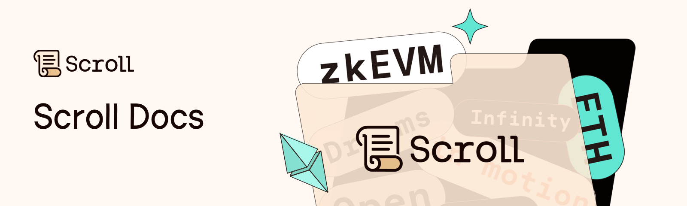

 

This repository catalogs projects submitted to the various hackathons Scroll has supported. If can be a great place to explore what devlopers are building and find inspiration for your next project.

## Hackathons
### ETHBarcelona

- [**Bevolved.xyz (http://bevolved.xyz/)**](https://devfolio.co/@cfiestas)  🥇 — Where learning tech blossoms
- [**Pitstop Protocol**](https://devfolio.co/@cedric)  🥇 — Pitstop Protocol Empowers Developers to Build Interactive, Immersive, and Blockchain-Powered Fantasy Sports Games with Web3, Real-Time Data, and User-Owned Assets.
- [**PromptHunt**](https://devfolio.co/@gonzalobarria)  🥇 — The open and collaborative repository of AI prompts
- [**123**](https://devfolio.co/@rotcivegaf)  — 1
- [**AtomiK**](https://devfolio.co/@rotcivegaf)  — The first DEX doing cross-chain atomic swaps with ZK for liquidity providing, increasing security in bridging between Aleo & XDC…
- [**Barcelona Memories**](https://devfolio.co/@mbabu)  — Mint it guys.
- [**Communify**](https://devfolio.co/@Skydaworld)  — Communifying your donations and impact!
- [**DEVOW: Decentralized Vowing**](https://devfolio.co/@d3portillo)  — Devow is a crowdfunding platform designed to support women entrepreneurs by providing them a supportive ecosystem to raise funds for…
- [**Decentralised chat application**](https://devfolio.co/@Akhil2310)  — This app makes chatting and calling more secure, and no centralised authority has control over its data, making it the…
- [**Gather**](https://devfolio.co/@Jeng)  — helping people form meaningful connections offline with stake to date
- [**Joy Journey**](https://devfolio.co/@DevAdria) 
- [**Khrêsmós**](https://devfolio.co/@blablalf)  — A decentralized oracle for the XDC blockchain to accurately compute and convey data sources from various node
- [**LibNet**](https://devfolio.co/@IvanSeagull)  — From Bookshelf to Blockchain
- [**NFT Address Options**](https://devfolio.co/@memexpo)  — Cross-chain market for smart-contract deployment possibilities
- [**No Fear NFTs. ERC-721 Extension for NFTs and DeFi**](https://devfolio.co/@nicolasmarin)  — nfNFTs (No Fear NFTs), an ERC-721 extension designed to empower creators in building NFT projects with robust DeFi mechanics while…
- [**Springer**](https://devfolio.co/@kellykimxyz)  — Web3 Couchsurfing For The Vibe Economy
- [**TimeFi**](https://devfolio.co/@alra)  — Tokenize your hours for valuable exchanges, reshaping how we communicate and interact professionally and personally.
- [**UANS**](https://devfolio.co/@ydcurious)  — Universal Asset Numbering Scheme
- [**Zero Knowledge Pay**](https://devfolio.co/@kenilshahh)  — Decentralised ZK messaging with Defi Features X Fund the best Public Good Projects with Zk.
- [**dGPT**](https://devfolio.co/@intifelipe)  — What happens if you free GPT by putting it on the blockchain?

### ETHDam

- [**Multi-Token transparent vesting**](https://taikai.network/cryptocanal/hackathons/ethdam/projects/clhx4bwgk100652801y9djo83y3l)  🥇
- [**electora**](https://taikai.network/cryptocanal/hackathons/ethdam/projects/clheoeawk122970901y97db0x7qg)  🥇
- [**StealthSend**](https://taikai.network/cryptocanal/hackathons/ethdam/projects/clhvqtsit72287701wpkyv9ffwq)  🥇
- [**Alpha Zikileaks**](https://taikai.network/cryptocanal/hackathons/ethdam/projects/clhx7qd5b106521901wp70gul2x4) 
- [**Sybil-resistent NFT Marketplace / Launchpad**](https://taikai.network/cryptocanal/hackathons/ethdam/projects/clhwt9co496907501y91bplvdjg) 
- [**Private Business**](https://taikai.network/cryptocanal/hackathons/ethdam/projects/clhxb0286110499201y90vrb8hxc) 
- [**MaskedMerchants**](https://taikai.network/cryptocanal/hackathons/ethdam/projects/clhvp0hel69787401wpdwsbg151) 
- [**WhatsDapp**](https://taikai.network/cryptocanal/hackathons/ethdam/projects/clhv1b7rh49809601wpkcd4pemo) 
- [**MysticLoot**](https://taikai.network/cryptocanal/hackathons/ethdam/projects/clhw46iyk82912201y9c1m0g927) 
- [**Another ZK Project - ZKPay**](https://taikai.network/cryptocanal/hackathons/ethdam/projects/clhxb2yr4121242001zlpx01djwu) 
- [**SOCIAL BOOST**](https://taikai.network/cryptocanal/hackathons/ethdam/projects/clhxcu5ii120766401wpm92n645n) 
- [**Scrolling**](https://taikai.network/cryptocanal/hackathons/ethdam/projects/clhw2ckub92218801xzmpqapr79) 
- [**safuteam**](https://taikai.network/cryptocanal/hackathons/ethdam/projects/clhxbrwyo113539101y9dtcfzewj) 

### ETHDenver

- [**0xFable**](https://app.buidlbox.io/projects/0xfable)  🥇
- [**AI Coliseum: NPC Wars**](https://app.buidlbox.io/projects/npc-wars)  🥇
- [**Abrey**](https://app.buidlbox.io/projects/arbey)  🥇
- [**Composooor**](https://app.buidlbox.io/projects/composooor)  🥇
- [**Dynamic Stableswap**](https://app.buidlbox.io/projects/dynamic-stableswap)  🥇
- [**Facade**](https://app.buidlbox.io/projects/facade)  🥇
- [**Hunter Z Hunter**](https://app.buidlbox.io/projects/hunter-z-hunter)  🥇
- [**L's with Frens**](https://app.buidlbox.io/projects/ls-with-frens)  🥇
- [**Mercury Protocol**](https://app.buidlbox.io/projects/mercury-protocol)  🥇
- [**My Mül**](https://app.buidlbox.io/projects/bull-bear)  🥇
- [**Peanut Protocol**](https://app.buidlbox.io/projects/peanut-protocol)  🥇
- [**RNGesus**](https://app.buidlbox.io/projects/rngesus)  🥇
- [**rhinestone**](https://app.buidlbox.io/projects/rhinestone)  🥇
- [**swosh.cash**](https://app.buidlbox.io/projects/swosh)  🥇
- [**1m65**](https://app.buidlbox.io/projects/1m65) 
- [**Adonis**](https://app.buidlbox.io/projects/adonis) 
- [**Alice's Ring**](https://app.buidlbox.io/projects/alice-ring) 
- [**Ape Harmony**](https://app.buidlbox.io/projects/ape-harmony) 
- [**AuthSec**](https://app.buidlbox.io/projects/authsec) 
- [**BluebirdSwap**](https://app.buidlbox.io/projects/bluebirdswap) 
- [**Cognoscenti**](https://app.buidlbox.io/projects/cognoscenti) 
- [**Connectr**](https://app.buidlbox.io/projects/connectrcontactapp) 
- [**CrossFuel**](https://app.buidlbox.io/projects/crossfuel) 
- [**DAOtributor**](https://app.buidlbox.io/projects/daotributor) 
- [**DeFi Detective**](https://app.buidlbox.io/projects/defi-detective) 
- [**DeFi Pooler**](https://app.buidlbox.io/projects/defi-pooler) 
- [**Degen Reborn**](https://app.buidlbox.io/projects/degen-reborn) 
- [**Diing**](https://app.buidlbox.io/projects/diing-finance) 
- [**Dual Rollup ZK Opt**](https://app.buidlbox.io/projects/dual-rollup-zk-opt) 
- [**FIGHT CLUB - DAOs Helping Businesses**](https://app.buidlbox.io/projects/fight-club) 
- [**Fuzzy Duck**](https://app.buidlbox.io/projects/fuzzy-duck) 
- [**Geni**](https://app.buidlbox.io/projects/geni) 
- [**Huffswap**](https://app.buidlbox.io/projects/huffswap) 
- [**IDEN-SIGHT**](https://app.buidlbox.io/projects/iden-sign-zk) 
- [**Krypto Kredit**](https://app.buidlbox.io/projects/krypto-kredit) 
- [**LenScholar**](https://app.buidlbox.io/projects/lenscholar) 
- [**LensScholar**](https://app.buidlbox.io/projects/lensscholar) 
- [**Lumen**](https://app.buidlbox.io/projects/lumen) 
- [**MediKey**](https://app.buidlbox.io/projects/medikey) 
- [**My Room**](https://app.buidlbox.io/projects/web3getter) 
- [**NFT Hot Pot**](https://app.buidlbox.io/projects/nft-hot-pot) 
- [**OpenAsk**](https://app.buidlbox.io/projects/open-ask) 
- [**ParaSequencer**](https://app.buidlbox.io/projects/parasequencer) 
- [**ParaSequencer**](https://app.buidlbox.io/projects/parallel-sequencer) 
- [**Proof of Nurse**](https://app.buidlbox.io/projects/healthyourself) 
- [**Raz Captcha Crater**](https://app.buidlbox.io/projects/raz-captcha-crater) 
- [**RealFT**](https://app.buidlbox.io/projects/realft) 
- [**Recursive**](https://app.buidlbox.io/projects/recursive) 
- [**Solforge**](https://app.buidlbox.io/projects/solforge) 
- [**Talent Pay**](https://app.buidlbox.io/projects/talent-pay) 
- [**Zonulet**](https://app.buidlbox.io/projects/zonulet) 
- [**araSequencer**](https://app.buidlbox.io/projects/parallel-sequencer) 
- [**baZaarK**](https://app.buidlbox.io/projects/bazaark) 
- [**hairgoals eTherapy**](https://app.buidlbox.io/projects/hairgoals-etherapy) 
- [**zKOS**](https://app.buidlbox.io/projects/zkdao) 
- [**zkAuth**](https://app.buidlbox.io/projects/zkauth) 
- [**zkPoEX - zk Proof of Exploit**](https://app.buidlbox.io/projects/zkpoex) 

### ETHGlobal Lisbon

- [**$lice**](https://ethglobal.com/showcase/lice-fi4bo)  — $lice is a fast, free and frictionless P2P crypto payments dapp. It leverages account abstraction to allow for gasless transactions.…
- [**ABINITIO**](https://ethglobal.com/showcase/abinitio-1m29v)  — Platform that provides funding for developers to attend in person hackathons.
- [**CatX**](https://ethglobal.com/showcase/catx-k0d1e)  — Instant, tradeable, automated catastrophe bonds to help protect the world from natural disasters
- [**ChainState**](https://ethglobal.com/showcase/chainstate-er4sf)  — ChainState is a no-code tool to help generate position reports for auditors.
- [**Coffin Finance**](https://ethglobal.com/showcase/coffin-finance-fp4g3)  — Cof.fin is a decentralized finance (DeFi) platform that enables users to maximize their yield from liquidity mining through automated leveraged…
- [**Confido**](https://ethglobal.com/showcase/confido-d92y6)  — A trust marketplace where people can offer their services based on their reputation. Reputation being a lifetime score that cannot…
- [**Credential Corgi**](https://ethglobal.com/showcase/credential-corgi-a7a0r)  — Credential Corgi enables creation of certification standards, issuance of ZKP-compatible certificates, and a request-proof exchange between 3rd parties and credential…
- [**DeSave**](https://ethglobal.com/showcase/desave-dy3cx)  — DeSave - A Public Goods Funding Dapp for Local Area Development.
- [**DesignChain**](https://ethglobal.com/showcase/designchain-hv99y)  — DesignChain is a platform where users can share their UX/UI, receive valuable feedback and compete for rewards.
- [**Donation Station**](https://ethglobal.com/showcase/donation-station-g09ok)  — Donation Station saves you from high gas fees in the next Gitcoin round by allowing you to donate on your…
- [**ERC-20 Token on Linea and Scross**](https://ethglobal.com/showcase/erc-20-token-on-linea-and-scross-n64ya)  — Scrollina is the epitome of Meme Coins - Deploying an ERC-20 token on Linea and Scroll - LFG!!!!!!!!!
- [**GSpot**](https://ethglobal.com/showcase/gspot-dpqnf)  — The Hotspot 4G/5G for telecom network, connect seamless to a new network and enjoy pay as you go data.
- [**Green-Pluto**](https://ethglobal.com/showcase/green-pluto-auxsn)  — A social hybrid betting-trading game where AI trading algos compete for profit and users bet on algos
- [**Guardian Oracle-Keeper Protocol**](https://ethglobal.com/showcase/guardian-oracle-keeper-protocol-rpcws)  — Novel on-chain Keeper protocol which reacts upon price actions immediately, within the same transaction.
- [**Jacuzzi**](https://ethglobal.com/showcase/jacuzzi-gj1xz)  — Jacuzzi enables users to create intelligent self-custodial index funds via smart contract accounts. With Jacuzzi you can transform your fiat…
- [**Kangaroo Court**](https://ethglobal.com/showcase/kangaroo-court-ai3xf)  — AI meets human wisdom. Resolve AI-Oracle conflicts fairly. Human judges, prosecutors, defenders, jurors, and bailiffs on Optimism, Linea, and Scroll…
- [**Kinetex Flash (zk)**](https://ethglobal.com/showcase/kinetex-flash-zk-zh8vj)  — The Future of Cross-Chain Based on Zero-Knowledge Proofs. Peer-to-peer trading platform with instant order confirmation and low gas costs. Move…
- [**Legit**](https://ethglobal.com/showcase/legit-sbo0s)  — Are you legit? Verified personal experiences - collect your work/events/education experiences and let them be verified.
- [**LenSsion**](https://ethglobal.com/showcase/lenssion-8yozn)  — EIP/ERC Fiesta => 6551 x 4337 x 1271 x 712 all partying on Lens! NFTs can now have their own…
- [**Lens Alfred**](https://ethglobal.com/showcase/lens-alfred-cqbku)  — Query all the LENS data in natural language! Discover content, find the accounts to follow, understand your followers!
- [**Mose the Hose**](https://ethglobal.com/showcase/mose-the-hose-9f0xu)  — Enable NFT borrowers to self-liquidate if they can't repay their loan.
- [**Natural Chain - AI Toolkit for the Blockchain**](https://ethglobal.com/showcase/natural-chain-ai-toolkit-for-the-blockchain-ho5mq)  — NaturalChain is an AI Toolkit that empowers users to interact with the EVM ecosystem using natural language, facilitating tasks such…
- [**Oculto**](https://ethglobal.com/showcase/oculto-bqr10)  — Pay and unlock content, in a private way, directly with your Lens account. Pay back your friends, donate without censorship,…
- [**Omnichain AMM on CILA**](https://ethglobal.com/showcase/omnichain-amm-on-cila-zohc6)  — During that hackathon we had been building an omnichain smart-contract for Automated Market Maker. This is an AMM that works
- [**Omoide - for your beloved ones**](https://ethglobal.com/showcase/omoide-for-your-beloved-ones-5v62r)  — Send messages to loved ones, recorded on-chain for irrevocable access. Omoide boosts security with extra encryption, decoded via an NFC…
- [**OtherSwipe for the Otherside**](https://ethglobal.com/showcase/otherswipe-for-the-otherside-qmdmm)  — Otherswipe is a fiat to Apecoin gift card store. Buy Apecoins easily without knowing the receiver's wallet address or even…
- [**PepeHappy Coin**](https://ethglobal.com/showcase/pepehappy-coin-84e0i)  — My first smart contract deploy. Using this oportunity to learn
- [**Piggy Faucet**](https://ethglobal.com/showcase/piggy-faucet-nmrp7)  — Developers may struggle to obtain test tokens from various networks. Piggy Faucet addresses this by providing a Chrome extension for…
- [**Prepago**](https://ethglobal.com/showcase/prepago-7ddis)  — Scratch-off, disposable prepaid crypto cards for bankless onboarding
- [**Privacy-preserving Paymaster**](https://ethglobal.com/showcase/privacy-preserving-paymaster-hap9s)  — Paymaster that enables fully private withdrawals from mixers and roll-ups
- [**Qsound**](https://ethglobal.com/showcase/qsound-sqju3)  — A music streaming platform where anyone can sell their songs by token gating them on a flexible subscription basis implemented…
- [**Quest Wallet**](https://ethglobal.com/showcase/quest-wallet-59u08)  — QuestWallet is a smart contract wallet (ERC4337) that provides gasless transactions in exchange for completing a quest. A quest can…
- [**RIPTIDE**](https://ethglobal.com/showcase/riptide-taxdo)  — RIPTIDE is a protocol for managing the distribution and inflation of digital assets. It ensures that items (NFTs) can grow…
- [**Selfy**](https://ethglobal.com/showcase/selfy-00wm3)  — Selfy is an all-in-one privacy-preserving solution allowing you to create your digital profile by fetching off-chain & on-chains data. This…
- [**Shortly**](https://ethglobal.com/showcase/shortly-a1c05)  — A web3 affiliate marketing tool that converts clicks into crypto (bitly, but with a twist).
- [**SplashX**](https://ethglobal.com/showcase/splashx-poof9)  — Do you love Anime? Yes! Do you make your own Anime? No! It takes too long. Introducing SplashX. Join a…
- [**Web3 Game Dev Toolbox**](https://ethglobal.com/showcase/web3-game-dev-toolbox-r8yvg)  — Web3 Game Dev Toolbox is a hassle-free platform and SDK designed specifically for web2 game developers.
- [**WingWallet - point-of-sale crypto payment**](https://ethglobal.com/showcase/wingwallet-point-of-sale-crypto-payment-hf435)  — Introducing our smart wallet - the ultimate solution for seamless crypto transactions! With our point-of-sale crypto payment app, users can…
- [**XenOnScroll**](https://ethglobal.com/showcase/xenonscroll-y65i4)  — XEN is a fair crypto project which is currently deploying 12 blockchains. XEN is based on the ERC20 token standard…
- [**YubiCastle**](https://ethglobal.com/showcase/yubicastle-vqzxj)  — Secure your crypto assets with a tiny YubiKey using EdDSA/Ed25519
- [**Zap Network**](https://ethglobal.com/showcase/zap-network-8fy2i)  — The Zap Network is a decentralized market for electricity trading. Users can leverage the Zap network to get the best…
- [**lensLend**](https://ethglobal.com/showcase/lenslend-0o7rz)  — A protocol that allow creators to leverage their reputation and make it collaterizable.
- [**rainshower poools**](https://ethglobal.com/showcase/rainshower-poools-0aeac)  — Abstraction for an undercollateralized lending protocol designed to make usage seamless
- [**snake3.xyz**](https://ethglobal.com/showcase/snake3-xyz-tn9j2)  — Combining several access gating technologies in one. A B2B solution that allows DAPPs to implement all kind of gating mechanisms…
- [**upstar**](https://ethglobal.com/showcase/upstar-rbutt)  — By holding membership NFTs, you're not just part of an exclusive club, but you're also building an emotional bond with…
- [**web3-gpt4**](https://ethglobal.com/showcase/web3-gpt4-jkaja)  — Web3 GPT-4 simplifies smart contract deployment. Users input Solidity code into the Chat GPT interface, select an EVM-compatible blockchain, and…

### ETHGlobal New York

- [**Captain Hooks**](https://ethglobal.com/showcase/captain-hooks-s9b1f)  🥇 — Building modular hooks that enable better tradFi adoption with UniswapV4
- [**Abstract Wallet**](https://ethglobal.com/showcase/abstract-wallet-a9pzf)  🥇 — Wallet abstraction enables instant single click onboarding of a user. With nothing but a smartphone using the power of account…
- [**Correlatzia 🔀**](https://ethglobal.com/showcase/correlatzia-vgczy)  🥇 — DeFi doesn't look sexy anymore? Stop trading on price and gear up to become a correlation swaps master! Pick two…
- [**Soho**](https://ethglobal.com/showcase/soho-xo1fi)  🥇 — A marketplace for APIs enabling crypto payments for web2 APIs and decentralizing the internet even further!
- [**TrueP2P**](https://ethglobal.com/showcase/truep2p-9wbj6)  🥇 — P2P swaps market based on onchain wire transfer confirmation
- [**AirTracker**](https://ethglobal.com/showcase/airtracker-8qstn)  🥇 — Decentralized physical asset tracking using AirTags and blockchain storage and messaging
- [**SamuraiDocuSign**](https://ethglobal.com/showcase/samuraidocusign-gjg8a)  — Trustless & UX evolved document signing dApp!! We've built secure access-control & no censorship signing and providing gasless signing user…
- [**Datacache**](https://ethglobal.com/showcase/datacache-r68bo)  — A marketplace for your data. Data monetization/marketplace where identity holders (anyone) can verify about their data (by issuers, like KYC)…
- [**Onchain Game**](https://ethglobal.com/showcase/onchain-game-ivx4j)  — I figured out how to mint within a browser-based game UI across 7 blockchains, using nouns artwork.
- [**zkDoctor**](https://ethglobal.com/showcase/zkdoctor-jyqmd)  — zkDoctor: Privacy-first healthcare made possible through blockchain. Get diagnostics without revealing personal data, thanks to zero-knowledge proofs. We safeguard your…
- [**Dononymous**](https://ethglobal.com/showcase/dononymous-6hubz)  — Dononymous allows you to donate anonymously, and ensures your donation always aligns with your interests.
- [**Keybox.AI Pilot**](https://ethglobal.com/showcase/keybox-ai-pilot-1x9pn)  — This tool fetches smart contract codes from blockchain explorers and uses Google LLM AI for translation and risk analysis. Features…
- [**Stake2Reserve**](https://ethglobal.com/showcase/stake2reserve-fagrh)  — "Stake2Reserve" is a restaurant reservation platform using DeFi to incentivize and prevent No-shows.
- [**Social Signal**](https://ethglobal.com/showcase/social-signal-ky0we)  — Social Signal - Form your tribe and signal your values across all web3 apps.
- [**WhatLet**](https://ethglobal.com/showcase/whatlet-in7rs)  — One stop DeFi from WhatsApp to serve LatAm to onboard the next billion humans to web3
- [**AIPodo**](https://ethglobal.com/showcase/aipodo-kikp5)  — Data provider and workers can prove they contribution and ask part of the final payment with hash stored within the…
- [**Bamboo Lending**](https://ethglobal.com/showcase/bamboo-lending-en6c6)  — Collateralized physical p2p borrow and lending marketplace using web 3 social
- [**dBeats**](https://ethglobal.com/showcase/dbeats-3zfou)  — dBeats is the ultimate sound platform and market ecosystem on-chain, built for artists and DJs to find unique, high quality…
- [**tAAke Five**](https://ethglobal.com/showcase/taake-five-rrbfb)  — tAAke five, an Interactive DeFi platform, dramatically improves DeFi investment UX. We empower users to make smarter, easier choices to…
- [**NYCV4Hermit**](https://ethglobal.com/showcase/nycv4hermit-dj0um)  — Prevent Liquidity Snipping for protecting Liquidity Provider
- [**NFT4Local**](https://ethglobal.com/showcase/nft4local-ik2qt)  — Empower your local community, one NFT at a time. This platform aims to provide NFT backed local business support in…
- [**HouseFee**](https://ethglobal.com/showcase/housefee-k0daf)  — A protocol between owner and tenant that allows the rental of properties without a property deed.
- [**ZeroFi**](https://ethglobal.com/showcase/zerofi-tatma)  — Enabling non-collateralized and instant loans through SocialFi and game theory.
- [**StudySplash6551**](https://ethglobal.com/showcase/studysplash6551-vikqd)  — 🐳✨A innovative cohort-based learning platform leveraging ERC6551 for users enhances community bonding and maintains learner motivation by immortalizing achievements with…
- [**The Arens**](https://ethglobal.com/showcase/the-arens-i5jjb)  — Enter The Arena, an NFT liquidity protocol where DAO members can reverse-sweep their precious JPEGs.
- [**FairDrop**](https://ethglobal.com/showcase/fairdrop-qcayi)  — FairDrop ensures fair and transparent airdrop/lottery events by employing Unique Participant Verification via VDF, User Persona, and DID, reducing fraud…
- [**POWDone**](https://ethglobal.com/showcase/powdone-k1rut)  — Gamified goal and milestone accomplishment with adaptable verification methods suited for private, group and public goal tracking. Replace tedious journaling…
- [**Token Hotel**](https://ethglobal.com/showcase/token-hotel-0a6qf)  — A on-chain board game where you buy, build, and upgrade hotels
- [**MEVictim Rebate**](https://ethglobal.com/showcase/mevictim-rebate-qsxak)  — Designing better market incentives by identifying MEV victims using historical on chain data and airdropping victims a token to access…
- [**Linkt.tv**](https://ethglobal.com/showcase/linkt-tv-bs3qt)  — Linkt.tv: Exclusivity with Impact—where fans not only unlock premium content but drive its value in a token-gated ecosystem and secondary…
- [**did:health**](https://ethglobal.com/showcase/did-health-9cva8)  — did:health is a W3c DID that leverages decentralized cryptography for identity based encryption and signing of healthcare data and serves…
- [**KrossChain**](https://ethglobal.com/showcase/krosschain-m6ddk)  — You now have your control over the Non Fungible tokens by saving your preference on chain
- [**Smol Ask**](https://ethglobal.com/showcase/smol-ask-as38o)  — Smol Ask is a socially-powered, intent-centric platform on Lens.
- [**ENS Scroll L2**](https://ethglobal.com/showcase/ens-scroll-l2-go733)  — "Streamlining ENS subname registration via L2 solutions: Deploy NFT contracts to Scroll, modify Cloudflare worker for L2, test via L1…
- [**Zero Guard**](https://ethglobal.com/showcase/zero-guard-9qnze)  — A decentralized zero knowledge powered AI Red Team Network that improves diversity, safety to AI through community
- [**Defi Assistant**](https://ethglobal.com/showcase/defi-assistant-i4gox)  — Digital assistant for DeFi that uses AI-powered local speech-to-text.
- [**Rewardify**](https://ethglobal.com/showcase/rewardify-rnxqb)  — Rewardify is a multichain dashboard built on BOS that allows communities to earn rewards through social engagement, helping projects gain…
- [**Arb Controller**](https://ethglobal.com/showcase/arb-controller-dw3so)  — A uniswap v4 hook that sets dynamic fee for a pool based on the price movements. The dynamic fee partially…
- [**Zenon**](https://ethglobal.com/showcase/zenon-nttoa)  — Crowdfunding campaigns: create, claim you money. Crowdfunding campaigns: create, claim you money. Crowdfunding campaigns: create, claim you money.
- [**3D Print Ur NFT**](https://ethglobal.com/showcase/3d-print-ur-nft-hfzdo)  — 3D print your NFT and get it delivered to your home via Shopify.
- [**Safe Invaders**](https://ethglobal.com/showcase/safe-invaders-coyao)  — Secure and gasless collaboration for smart contract development. No more key sharing or multi wallet funding.
- [**Talk.online**](https://ethglobal.com/showcase/talk-online-jqkvd)  — Seven web3 social media dApps all integrating ENS. The interface allows users to post and like/dislike other posts
- [**TimeConcentrate**](https://ethglobal.com/showcase/timeconcentrate-c58h4)  — Concentrate liquidity along price and now TIME with uni v4 hooks.
- [**Quiztopia**](https://ethglobal.com/showcase/quiztopia-qnz6d)  — Quiztopia is the ultimate fusion of learning and entertainment. Dive into a world of knowledge with our gamified education trivia…
- [**Web3backers**](https://ethglobal.com/showcase/web3backers-ki4qp)  — Web3backers connects your existing web3 and web2 social accounts and information (see ENS< lens, linkedin, twitter, github, on-chain, etc.) to…
- [**InterSwaps**](https://ethglobal.com/showcase/interswaps-idpd8)  — The first DEX doing cross-chain atomic swaps with ZK for liquidity providing, increasing security in bridging between Aleo & EVM…
- [**Survey Donkey**](https://ethglobal.com/showcase/survey-donkey-pvax5)  — A platform to launch fully-decentralized and incentivized surveys
- [**EtherEats**](https://ethglobal.com/showcase/ethereats-v4iep)  — Decentralised Delivery Service App with Fair Compensation & Prices
- [**MondayTrip**](https://ethglobal.com/showcase/mondaytrip-7bsy6)  — MondayTrip is a decentralized Web3 app that helps you and your friends find and book hostels together. With MondayTrip, you…
- [**IntelliQuiz**](https://ethglobal.com/showcase/intelliquiz-vb617)  — IntelliQuiz simplifies the process of creating customized quizzes on a wide range of subjects, all through straightforward inquiries. Driven by…
- [**Rise Finance**](https://ethglobal.com/showcase/rise-finance-bnw3m)  — A perpetual DEX with a price feed integrity proof using ZK-SNARK circuits.
- [**NFT Pool Party**](https://ethglobal.com/showcase/nft-pool-party-snybc)  — Launch your NFT collection on Uniswap & earn ongoing income streams from royalties (again)
- [**EtherNoirs**](https://ethglobal.com/showcase/ethernoirs-sysuw)  — A mystery game enhanced by ZKPs, ERC-6551s. You can win by score or by deduction. You can trade tips/info to…
- [**PokoWars**](https://ethglobal.com/showcase/pokowars-j559y)  — Immerse yourself in the ultimate card battle experience. Mint your unique NFT cards and engage in strategic battles. Stake your…
- [**Crosschain API**](https://ethglobal.com/showcase/crosschain-api-c6xtj)  — Leveraging the compute power of Phala Network on Polkadot, we can bring offchain APIs to any EVM network. This this…
- [**Social Token**](https://ethglobal.com/showcase/social-token-fu457)  — aims to provide an invaluable ecosystem where new developers can gain hands-on experience, expand their portfolios, acquire new technical skills,…
- [**Voteconomy**](https://ethglobal.com/showcase/voteconomy-gucda)  — Balancing UX and on-chain integrity in DAOs: We simplify voting with account abstraction and session keys, sparing users gas fees…
- [**Wander**](https://ethglobal.com/showcase/wander-a0stf)  — Programmable payments POC that awards a dynamic NFT to a tourist visiting NYC and paying with crypto.
- [**Cycrane Wallet**](https://ethglobal.com/showcase/cycrane-wallet-d3wv7)  — Sign and send transactions by sending an email via account abstraction and ZK
- [**Playz**](https://ethglobal.com/showcase/playz-12fv0)  — Playz is a decentralized social media platform that offers a space for artists to engage fans with token-gated access &…
- [**HOA DAO**](https://ethglobal.com/showcase/hoa-dao-vghad)  — MVP DAO deployed on Sepolia Scroll to help decentralize homeowners associations
- [**Chirp**](https://ethglobal.com/showcase/chirp-y4jib)  — Chirp is a fully decentralized Twitter. Every tweet is on-chain.
- [**A Pool Party**](https://ethglobal.com/showcase/a-pool-party-88mco)  — An OmniChain Single Sided Liquidity Provider designed for maximum capital efficiency and ease of use! Utilizing Uniswap v4 hooks &…
- [**Bounce**](https://ethglobal.com/showcase/bounce-jxqoc)  — Non-custodial real world NFC card peer to peer payments based on PoS terminals.
- [**checkmate**](https://ethglobal.com/showcase/checkmate-61wbj)  — Introducing "Checkmate," the groundbreaking Verifiable zkML Social Media application designed to revolutionize online interaction and data privacy. Checkmate takes the…
- [**Xclusiv**](https://ethglobal.com/showcase/xclusiv-fiyza)  — The Xclusiv Telegram Bot can be used by project to create holder only telegram groups, requiring members to either stake…
- [**Gas Pass**](https://ethglobal.com/showcase/gas-pass-thumd)  — Perpetual gasless transactions. We want to incentivize people to contribute to any social good goals (like EIPs). We do this…
- [**HelloScroll**](https://ethglobal.com/showcase/helloscroll-t5i1x)  — This app shows the potential of L2 rollups like Arbitrum & privacy L2s like Scroll. It uses Scroll for secure…
- [**MaskD**](https://ethglobal.com/showcase/maskd-3gdk5)  — A ZKP protocol for obfuscating your wallet address from your spendings
- [**DFA**](https://ethglobal.com/showcase/dfa-pm9pp)  — A Decentralized, secure, fast, hassle free, and cost effective 2-Factor Authentication method
- [**NFT Lottery**](https://ethglobal.com/showcase/nft-lottery-hkd9t)  — A lottery where NFT can be minted by owner of contract and then participants can pay .0001 eth to enter,…
- [**OmniNFT**](https://ethglobal.com/showcase/omninft-cs0jy)  — Why bridge NFTs when they can be synced across all available chains all the time
- [**ProofOSomething**](https://ethglobal.com/showcase/proofosomething-cw2ji)  — Make 4337 wallets anywhere and everywhere and have them all have proof of humanhold!

### ETHGlobal Tokyo

- [**0xMarket**](https://ethglobal.com/showcase/0xmarket-u0kea)  — 0xMarket, an account marketplace, enables trading of non-tradable assets with ownership transfer using ERC-4337, creating new value streams for users.…
- [**AbswapX**](https://ethglobal.com/showcase/abswapx-jmefw)  — An automation module to enable limit orders and scheduled strategies for DeFi
- [**AniMATE**](https://ethglobal.com/showcase/animate-f9pc3)  — AniMATE is a decentralised anime streaming platform that uses zero-knowledge proof for age verification and rewards users with an NFT,…
- [**AokiApp NFT**](https://ethglobal.com/showcase/aokiapp-nft-1t8k7)  — AokiApp NFT is a full-onchain NFT collection. It introduce a new image compression technology suited for mass-production NFTs, and achieves…
- [**Artsy Wave**](https://ethglobal.com/showcase/artsy-wave-e03w7)  — NFT Multi Level Marketing protocol that promotes creativity.
- [**Atomicflow**](https://ethglobal.com/showcase/atomicflow-s9nwc)  — Subscription protocol using INTMAX and Scroll. It enables flexible Dapps subscriptions powered by ZKP.
- [**Axel**](https://ethglobal.com/showcase/axel-0j1yc)  — Marketplace where developers can upload their saas products and get paid for usage all on chain! using zk we have…
- [**BillBoard**](https://ethglobal.com/showcase/billboard-8s872)  — BillBoard is your keyword ad space stored in the blockchain. You can replace the display if you pay the price,…
- [**BlitzSquad**](https://ethglobal.com/showcase/blitzsquad-2jt43)  — Play, your favorite games , stream the action live, and place bets with confidence with BlitzSquad.
- [**Blockhead: ETHTokyo 2023**](https://ethglobal.com/showcase/blockhead-ethtokyo-2023-kx4rh)  — Track, visualize & explore all of crypto, DeFi & web3 with Blockhead's crypto portfolio tracker, cross-EVM block explorer, and interfaces…
- [**BorrowFi**](https://ethglobal.com/showcase/borrowfi-ore25)  — BorrowFi is an aggregator that lets you borrow at the best rates possible
- [**Bot or Not**](https://ethglobal.com/showcase/bot-or-not-oox84)  — Bots are taking over the world and are dangerooooous. It is up to us the users the start contributing to…
- [**CTFhub**](https://ethglobal.com/showcase/ctfhub-4sy78)  — CTFhub is a one-stop-shop for CTF competitions. Now all the CTF rockstars are in one place and players can boast…
- [**Catch**](https://ethglobal.com/showcase/catch-znfs1)  — An RPC cache for 10x faster requests. Save time, money, and the environment!
- [**Clamp**](https://ethglobal.com/showcase/clamp-s04dr)  — Digital asset index for crypto newbies in less than thirty seconds
- [**Commit Rewarder - Open-Source DAO Tool**](https://ethglobal.com/showcase/commit-rewarder-open-source-dao-tool-jew1o)  — Our hackathon project uses Github Action and ChatGPT as the backbone to support our token reward system managed by CommitRewarder.…
- [**DayPass**](https://ethglobal.com/showcase/daypass-jf7vx)  — Send an NFT and automatically cover the recipients gas! Daypass allows the distribution and organization of gas sponsorship via NFTs…
- [**DeAcu: A decentralized auction market**](https://ethglobal.com/showcase/deacu-a-decentralized-auction-market-m95sn)  — DeAcu: A Web3 eBay/ã¤ããªã¯ auction market for ERC20 tokens and ERC721 NFTs, it supports ERC4337 wallet and L1/L2 chains
- [**DeCast**](https://ethglobal.com/showcase/decast-pp7jn)  — DeCast is an open-source and extensive live-streaming platform for creators.
- [**DeDeal**](https://ethglobal.com/showcase/dedeal-oc5ev)  — DeDeal is a decentralized escrow protocol for off-chain deals without any 3rd-party Intermediaries through self-sovereign sanction. DeDeal prevents fraud by…
- [**DeFi Gaurdian**](https://ethglobal.com/showcase/defi-gaurdian-5dvr8)  — Introducing a general purpose rate limit contract guardian to detect hacks and minimize losses at the smart contract level!
- [**DeFuture**](https://ethglobal.com/showcase/defuture-g31hx)  — Defutures, a decentralized futures trading exchange, meets users expectations to invest in a way it provides back both stability and…
- [**Developer Community as a Service**](https://ethglobal.com/showcase/developer-community-as-a-service-96cyc)  — A tool built for making delightful developer experiences, powered by Lens and Chat GPT.
- [**DoppeL.ink**](https://ethglobal.com/showcase/doppel-ink-w4c7g)  — Wallet that allows high-performance AI real-time voice changers to be rented on a pay-as-you-go basis or bought and sold as…
- [**ETHGPT**](https://ethglobal.com/showcase/ethgpt-yx4sp)  — ETHGPT: a GPT-powered ChatBot for accurate Ethereum info. We've compiled resources like go-ethereum and ethresear.ch to enhance ChatGPT's knowledge, keeping…
- [**GaaS**](https://ethglobal.com/showcase/gaas-exadm)  — Gate any app with arbitrary on-chain activity! Coming soon: JavaScript SDK and Rest API.
- [**GardenGrower ð¹**](https://ethglobal.com/showcase/gardengrower-ynd62)  — Multisignature verifier for public goods. Users lock ETH into the contract and can refund their ETH if a proposal has…
- [**Gogaku!!!**](https://ethglobal.com/showcase/gogaku-es5jv)  — Learn foreign languages with a voice-based game using LINE Talk & ChatGPT interface. Easily practice listening & speaking with NFT…
- [**H3aven - Gata (Governance for Data)**](https://ethglobal.com/showcase/h3aven-gata-governance-for-data-x94o4)  — Tokenized Access Control Application for Granular Data Governance
- [**Habit Hacker**](https://ethglobal.com/showcase/habit-hacker-46chx)  — Our service promotes consistent habits like exercise, healthy eating, and learning. Users can bet on their success with real money,…
- [**Hikyaku Protocol**](https://ethglobal.com/showcase/hikyaku-protocol-run4m)  — Hikyaku Protocol makes it a breeze to send web3 assets to anyone with just an email address, even if you…
- [**Hippocratic Island**](https://ethglobal.com/showcase/hippocratic-island-c8jez)  — It is a web3 platform for patients to communicate with each other, providing a safe and comfortable forum for those…
- [**JuryDAO**](https://ethglobal.com/showcase/jurydao-8gz4i)  — A DAO-driven security system for online gaming that uses blockchain technology to promote fairness and discourage cheating.
- [**Kizuna Protocol**](https://ethglobal.com/showcase/kizuna-protocol-51cxq)  — This is a lending platform that uses proof of humanity based on WorldID, allowing borrowers to access higher loan amounts…
- [**MENTAL POKER**](https://ethglobal.com/showcase/mental-poker-p6n6e)  — An On-chain poker game that you can connect your wallet, bet any tokens you like(So ApeCoin is available!), set NFT…
- [**MINAmal VRF**](https://ethglobal.com/showcase/minamal-vrf-ap9t9)  — A Library that provides developers with Trustless Verifiable Randomness proven by Recursive ZK Technology
- [**Mango**](https://ethglobal.com/showcase/mango-azfbe)  — Identity preserved multisig wallet management & airdrops for GitHub orgs. Empower moderators & contributors with Sismo Connect & Safe. Decentralized…
- [**Mastaa**](https://ethglobal.com/showcase/mastaa-ee43f)  — How to make new users come to your platform? Especially if they know nothing about web3? With Mastaa, we offer…
- [**Multiple access wallet**](https://ethglobal.com/showcase/multiple-access-wallet-ee26p)  — Jerry Finance, a cutting-edge Web3 payroll service, unifies FIAT and crypto salary payments while offering employees flexible payment options and…
- [**Nice Vote**](https://ethglobal.com/showcase/nice-vote-0oxa4)  — This privacy voting tool combines Intmax, Scroll, and PolygonZkEVM. Privacy tokens issued by Intmax can be used to vote for…
- [**OMZ**](https://ethglobal.com/showcase/omz-kszfc)  — OMZ is a MultiChain OTC market with notification function for p2p trading
- [**OkiScan**](https://ethglobal.com/showcase/okiscan-o79ru)  — A mobile-optimized Ethereum blockchain explorer with AI-assisted contract search, prioritized Read/Write methods, and an on-chain watchlist.
- [**Ourstock**](https://ethglobal.com/showcase/ourstock-o3om9)  — A decentralized marketplace for stock Images. Solving for high fees, copyright management issues and user-friendly Mobile UX, through NFTs for…
- [**Penguin Network**](https://ethglobal.com/showcase/penguin-network-jhkvu)  — L1 bond aggregator to give an secured network into Ethereum ecosystem and use this bond for decentralized trusless cross-chain arbitrary…
- [**PromptMintSite**](https://ethglobal.com/showcase/promptmintsite-va0f1)  — Prompt NFT mint site that allows users can mint their original prompts through this site and earn with it.
- [**Qi**](https://ethglobal.com/showcase/qi-2oagg)  — Qi is a transaction auction platform that reduces transaction cost for transactions. The cost reduction comes from three places 1.…
- [**Recursive ZK State Channels**](https://ethglobal.com/showcase/recursive-zk-state-channels-ymke6)  — A Lightning Network (state channels) built using recursive ZK-Snark Proofs
- [**SUSHI Career**](https://ethglobal.com/showcase/sushi-career-gxgjp)  — Send OSUSHI to your co-workers to say thank you!ãThis is a Web3 Service that can be easily used by web2…
- [**Save the tree children**](https://ethglobal.com/showcase/save-the-tree-children-96480)  — We are a team trying to make our planet a greener place by utilizing blockchain. We want to be a…
- [**Sciemurai Donations ð¥·**](https://ethglobal.com/showcase/sciemurai-donations-1qmtf)  — a decentralized platform that helps scientists, students, professors, institutions, philanthropists, and people to protect their intellectual ideas through a decentralized…
- [**Shima**](https://ethglobal.com/showcase/shima-n10ac)  — Shima is a decentralized RPC platform that connects anyone who wants to become an RPC provider by making their blockchain…
- [**Shishi-odoshi**](https://ethglobal.com/showcase/shishi-odoshi-2jgvo)  — Discord-integrated party game, that boosts communication within DAOs.
- [**Smart SAFT**](https://ethglobal.com/showcase/smart-saft-fehev)  — On-chain process for legal documents and verifiable money movement.
- [**SocialSecuritySnap**](https://ethglobal.com/showcase/socialsecuritysnap-b5vyt)  — MetaMask Snap enhances security through: 1) Lens Protocol integration, displaying contract interactions by followed users to flag potential spam 2)…
- [**Soul Bound Credentials**](https://ethglobal.com/showcase/soul-bound-credentials-nwovz)  — SBT(soul bound token) verification platform that helps integrate VC(verifiable credentials) with on-chain protocols
- [**Splend**](https://ethglobal.com/showcase/splend-yb3d1)  — A decentralized peer to peer lending protocol to connect social impact conscious lenders to borrowers who do not have access…
- [**Takarakuji**](https://ethglobal.com/showcase/takarakuji-d1xak)  — DApp that Let's you play Takarakuji scratch-off online uses ZK rollups
- [**Tanuki**](https://ethglobal.com/showcase/tanuki-s8ew9)  — Tanuki is a trustless wallet scoring protocol. It uses ZKPâs to trustlessly read historical on-chain activity to calculate wallet scores.…
- [**Thrift**](https://ethglobal.com/showcase/thrift-fjbwd)  — Thrift is website based Savings application which allows user to join clubs with Random users and save money with the…
- [**Trustless Trust Exchange**](https://ethglobal.com/showcase/trustless-trust-exchange-ba6im)  — A World of âTrustlessâ Trust Exchange -Leverage reliable, third-party evaluations for trust-building -Fair and unbiased decision-making for DAO and project…
- [**Try subscription model in crypto**](https://ethglobal.com/showcase/try-subscription-model-in-crypto-99xkm)  — Automatic extension of subscriptions based on pre-set allowance
- [**Web322**](https://ethglobal.com/showcase/web322-y2q42)  — Tamper-proof Web2 data sourcing on the blockchain without relying on costly repeated API calls. Web322 allows for public verification that…
- [**ZKAFI**](https://ethglobal.com/showcase/zkafi-70e80)  — A zero-knowledge Real World Asset (RWA) lending protocol. Use Credentials and private collaterals to borrow money in web3 world.
- [**ZKredentials**](https://ethglobal.com/showcase/zkredentials-costv)  — ZKredentials: Decentralized, trustless resume verification for anon devs. Powered by zk-SNARKs, Ethereum & IPFS. Showcase skills, maintain privacy, & prove…
- [**Zaisan**](https://ethglobal.com/showcase/zaisan-6dxue)  — Create promotions. Earn rewards without revealing data. Build the infinite community.
- [**Zen Garden**](https://ethglobal.com/showcase/zen-garden-bc71z)  — A game that lets you virtually own and care for a forest, with our actions performed in the real world.
- [**bitFlyer Governance**](https://ethglobal.com/showcase/bitflyer-governance-dvd5u)  — Our project uses proof of reserve to offer a more accessible and secure way for users to participate in governance.…
- [**dApp/Contract Verifier**](https://ethglobal.com/showcase/dapp-contract-verifier-jxa0h)  — Decentralized entity registry with Metamask snap that verifies dApp & smart contract address
- [**dLottery**](https://ethglobal.com/showcase/dlottery-o6mum)  — A lottery auto generator platform with a reverse lottery as its main feature. Unlike traditional lotteries where one person wins…
- [**splash X**](https://ethglobal.com/showcase/splash-x-25aff)  — SplashX is a video platform that streams rewards to their earliest and most devoted fans
- [**zkBadge**](https://ethglobal.com/showcase/zkbadge-mr4gi)  — Onboarding user's off-chain/on-chain reputations to web3 world by granting SBTs (Soul Bound Tokens) after on-chain zero-knowledge proof verification based on…
- [**zkBookReview**](https://ethglobal.com/showcase/zkbookreview-wkbks)  — We address the issues of existing book e-commerce and review sites by saving reviews on blockchain to prevent censorship and…

### ETHOnline

- [**Kindred**](https://ethglobal.com/showcase/kindred-0khmr)  🥇 — A platform for 0% interest loans amongst trusted peers that generates compound interest in large group sums
- [**zkEmail Safe**](https://ethglobal.com/showcase/zkemail-safe-z8dps)  🥇 — Operate Safe multisigs through email verified using ZK proofs
- [**zkVRF**](https://ethglobal.com/showcase/zkvrf-rt1d2)  🥇 — A novel method for verifiable onchain randomness (VRF) enabled by ZKPs.
- [**Caravan**](https://ethglobal.com/showcase/caravan-7evbj)  🥇 — Cross chain ERC 4337 compatible contract accounts as browser extensions
- [**gastly**](https://ethglobal.com/showcase/gastly-ybz7j)  🥇 — The one wallet to rule them all. Pay for gas using any token from any wallet, across all chains.
- [**SCBridgeAccount**](https://ethglobal.com/showcase/scbridgeaccount-ivyas)  🥇 — Building a 4337 compatible wallet which is a bridge into multi-chain state channel network. Send off-chain payments with your 4337…
- [**zkLC**](https://ethglobal.com/showcase/zklc-b531b)  🥇 — A trustless documentary letter of credit service for international buyers/sellers using the legal UCP standard for letters of credit (MT700…
- [**ChainGuard**](https://ethglobal.com/showcase/chainguard-j3cph)  🥇 — Enable encryption and decryption of data based on a custom combination of cross chain and natural language statements.
- [**Lit🔥Tornado🌪**](https://ethglobal.com/showcase/lit-tornado-9wokg)  🥇 — Developed Lit Tornado at the hackathon, a mixer app like Tornado Cash but using Lit Protocol - achieving confidential transactions…
- [**SherLOCKED**](https://ethglobal.com/showcase/sherlocked-0ux91)  🥇 — An FHE based privacy enabling infrastructure for EVM blockchains.
- [**ClubCast**](https://ethglobal.com/showcase/clubcast-2gr03)  🥇 — ClubCast - a DAO clubhouse where the member have the power to decide the topics members truly care about. Buy…
- [**Pindependent**](https://ethglobal.com/showcase/pindependent-3zvmd)  🥇 — A composable smart contract, incentive system which pays users of a DeFi app to host its front end on the…
- [**locker room**](https://ethglobal.com/showcase/locker-room-ep4ur)  🥇 — Save L1 rollup cost by utilizing calldata cache smart contract
- [**Sentiment Drips**](https://ethglobal.com/showcase/sentiment-drips-f7bin)  — Sentiment Drips is a flexible Allo framework that gives you building blocks to deploy liquidity to fund impact projects. Allo…
- [**Reveus**](https://ethglobal.com/showcase/reveus-946ou)  — The ultimate web3 review-to-earn platform, empowering businesses and startups with specialized reviews and vibrant communities for product success in the…
- [**Power Voting**](https://ethglobal.com/showcase/power-voting-w2p7t)  — Power Voting dApp aims to become the infrastructure for DAO governance.
- [**aRwa**](https://ethglobal.com/showcase/arwa-rr9vz)  — The project is an oracle for tokenizing things from real life. Each user can tokenize their property, and then put…
- [**POP!**](https://ethglobal.com/showcase/pop-b0avo)  — Explore a new way to trade cars with POP! Just snap a photo to create a digital twin of your…
- [**FusionwaveNFT**](https://ethglobal.com/showcase/fusionwavenft-j0kar)  — FusionwaveNFT is a GenerativeAI enabled Modern NFT Marketplace that caters to the needs of web3 enthusiasts, NFT artists, and AI…
- [**BlockAIDS**](https://ethglobal.com/showcase/blockaids-pg99j)  — BlockAIDS - a decentralized ecosystem designed for millions of people living with HIV and key affected populations
- [**ZKlash**](https://ethglobal.com/showcase/zklash-grui5)  — Welcome to ZKlash, beat the rest of the players and smash on your favourite NFT, to win prizes! Based on…
- [**FRKT**](https://ethglobal.com/showcase/frkt-zzggk)  — No-Code tools for Web2&3. FRKT(/frɪkt/) provides a frictionless UX for any app.
- [**Banker Smith**](https://ethglobal.com/showcase/banker-smith-k2m9h)  — xUSD is a cross-chain synthetic USD that offers capital efficiency with a 1:1 collateralization ratio without the risk of liquidation…
- [**Pandsal**](https://ethglobal.com/showcase/pandsal-trsci)  — Simplify Blockchain: Easy Onboarding, Endless Possibilities. Designed to guide everyday users and businesses into a user-friendly web3 experience. Walet-less, frictionless…
- [**NFT Themer**](https://ethglobal.com/showcase/nft-themer-rs7p4)  — Transform ordinary NFTs into visually stunning artworks with unique styles, themes, and interactivity!
- [**Omnichain ERC6551**](https://ethglobal.com/showcase/omnichain-erc6551-sgdck)  — We built a game console NFT with an associated omnichain ERC-6551 Token Bound Account to enable chain-agnostic in game asset…
- [**PeerPal**](https://ethglobal.com/showcase/peerpal-mkymj)  — PeerPal: Redefining DeFi for Peer-to-Peer Token Borrowing and Lending through mobile application
- [**Payton.so**](https://ethglobal.com/showcase/payton-so-dgc0k)  — 🚀Ditch the Chaos!🚀 Tired of juggling Google Sheets, notes & accountants for your team's crypto finance? Discover Payton.so to effortlessly…
- [**Bwise**](https://ethglobal.com/showcase/bwise-j8o9e)  — BWise: A Chrome extension leveraging Uniswap v4 hooks for optimized impermanent loss mitigation in DeFi ecosystems.
- [**Geppetto**](https://ethglobal.com/showcase/geppetto-ogaf6)  — Accounting & Management Software that permits reliable recording and tracking in natural language.
- [**Nomis**](https://ethglobal.com/showcase/nomis-wz0w1)  — Nomis is a multichain identity and reputation protocol that leverages users' onchain activity data and ML-powered mathematical modeling technologies to…
- [**troq**](https://ethglobal.com/showcase/troq-61euo)  — A self custodial chat-wallet for bartering that works both offline and offchain.
- [**Koinu**](https://ethglobal.com/showcase/koinu-x8ced)  — An npm library that provides hassle-free cross-chain token transfers in dapps. No more intensive dev work or deep blockchain knowledge…
- [**ZeppelinFinance**](https://ethglobal.com/showcase/zeppelinfinance-gvawn)  — Defi NFT financing RWA platform for ecommerce sellers, tap into the power of web3
- [**AutonomousSwap**](https://ethglobal.com/showcase/autonomousswap-ipg4a)  — An autonomous/decentralized swap app for tokens transfer between 2 parties without third-party intermediation :D
- [**dchat.ai**](https://ethglobal.com/showcase/dchat-ai-fakw9)  — Easy to create AI bots, but also have a marketplace for embeddable browser AI chat bots
- [**Kyōdō Protocol**](https://ethglobal.com/showcase/kyodo-protocol-fpvek)  — The Future of Work Powered by Communities Kyōdō Protocol facilitates trusted connections between these professional parties with a decentralized, blockchain-driven…
- [**FundifyMe**](https://ethglobal.com/showcase/fundifyme-aro10)  — Fundify Me, is a decentralized application (dApp) built on blockchain technology with a specific focus on supporting developers and their…
- [**ReliefReach**](https://ethglobal.com/showcase/reliefreach-tnt66)  — Streamlined relief fund donations platform connecting givers with global causes, making a difference in times of need.
- [**Laputa**](https://ethglobal.com/showcase/laputa-fg9ku)  — Build spectacular floating cities together in an on-chain massive multiplayer game. Featuring a unique in-game economy that is both Free…
- [**DAOOOR**](https://ethglobal.com/showcase/daooor-ajqa7)  — DAOOOR is a powerful tool for creating, joining and managing DAOs. Create a DAO with a treasury and a governance…
- [**Token Tutor**](https://ethglobal.com/showcase/token-tutor-bfyx4)  — Token Tutor: Revolutionize how you create value. 🚀 Tutors, tokenize your time as a valuable asset. 🎓 Learners, gain direct…
- [**AI-ducation**](https://ethglobal.com/showcase/ai-ducation-trnzr)  — AIducation uses AI and web3 to provide personalized learning paths, credentials via NFTs, and incentives aligned to knowledge growth.
- [**Space**](https://ethglobal.com/showcase/space-i40oe)  — A social platform seamlessly introduces Web2 users to Web3, without the complexities of crypto for quests or donations.
- [**UMA Time Clock**](https://ethglobal.com/showcase/uma-time-clock-qsjvj)  — UMA Time Card is a decentralized app (DApp) that leverages UMA's optimistic oracle mechanism for secure and reliable employee time…
- [**Umbrella**](https://ethglobal.com/showcase/umbrella-revxr)  — Payment application to create secure and safe web3 payments with the use of multi-layered safeguards
- [**BillionZKVoters**](https://ethglobal.com/showcase/billionzkvoters-hw1br)  — Massive scale secret voting with on-chain results using Zero Knowledge technology
- [**Searchable Project**](https://ethglobal.com/showcase/searchable-project-ze4bo)  — A Dapp to make it easy to Search for related projects and create SBT token with proof of ownership
- [**Refiq**](https://ethglobal.com/showcase/refiq-a3tbh)  — Refiq is a decentralized social media platform where users create unique NFT topics and set their own moderation policies. Users…
- [**Whissage**](https://ethglobal.com/showcase/whissage-9zu94)  — Whissage enables private crypto Q&A conversations. Askers pay ETH directly to an address to incentivize answers. Robust encryption, wallet integration,…
- [**Cryptopia**](https://ethglobal.com/showcase/cryptopia-vtoqx)  — A professional social platform for web3. Only verified project owner can post so less spams here.
- [**SuppX**](https://ethglobal.com/showcase/suppx-chb5u)  — This project provides multichain vault (erc4626) with flashloan support
- [**Bot Corp**](https://ethglobal.com/showcase/bot-corp-aoz9b)  — A bot corporation - Provide a product requirement and an organisation made up entirely of bots (NFT gated prompt instances)…
- [**Kuala Bond**](https://ethglobal.com/showcase/kuala-bond-d23x1)  — Kuala Bond is designed to simplify cross chain value transfers through the use of bonds
- [**CarFT**](https://ethglobal.com/showcase/carft-hny3z)  — We’re building web3 tools to help vehicle owners claim and transfer ownership of real world assets.
- [**Enigma**](https://ethglobal.com/showcase/enigma-q84ek)  — Enigma introduces the Secret NFTs standard: a unique dual URI approach. Each NFT showcases a public and a private layer.…
- [**guestbook**](https://ethglobal.com/showcase/guestbook-unwpw)  — Multi-chain guestbook built on Tableland that supports peer-to-peer messages
- [**PACKD**](https://ethglobal.com/showcase/packd-na5bq)  — PACKD is a project that allows users to create and share digital asset packs. These packs, which are NFTs that…
- [**Zkeytune**](https://ethglobal.com/showcase/zkeytune-tjgsg)  — A zero knowledge messaging social app using web3 and zero knowledge to protect your privacy
- [**The Session**](https://ethglobal.com/showcase/the-session-yrdb3)  — The Session is a DApp that builds a safe space for users and health professionals, where they can create support…
- [**AnyApe**](https://ethglobal.com/showcase/anyape-mmh8x)  — Gasless Cross-chain ApeCoin payment protocol implemented on an NFT marketplace.
- [**Buddy**](https://ethglobal.com/showcase/buddy-fo8cv)  — Multichain Person to Person Fiat-to-Crypto Exchange connecting individuals to trade fiat for cryptocurrencies with support for a wide range of…
- [**zkAccount**](https://ethglobal.com/showcase/zkaccount-fb3im)  — zkAccount seamlessly connects web2 identities to the web3 world using zero-knowledge proofs. Bridging traditional logins with decentralized platforms! 🌐🔒 #zkAccount…
- [**0xInvoices**](https://ethglobal.com/showcase/0xinvoices-wstpf)  — Free invoice generator. Create secure and private on chain invoices at low-cost
- [**AATBA Profile**](https://ethglobal.com/showcase/aatba-profile-gut0k)  — AATBA Profile: Fool-proof achievement verification. One account for all Sub-Profiles using Account Abstraction and Token Bound Account. Your achievements, securely…
- [**whale.finance**](https://ethglobal.com/showcase/whale-finance-2vby7)  — whale.finance basically implements Decentralized Asset Management with ERC 6551. We want to give the opportunity to investors sees their money…
- [**Spyd3r W3b**](https://ethglobal.com/showcase/spyd3r-w3b-5a7og)  — Empowering your web3 journey with robust security, insightful analytics, and unparallel software development workflow for your Dapps
- [**NET42**](https://ethglobal.com/showcase/net42-5jcpp)  — NFT-BASED RUNNING REWARDS FOR GOOD 🏃‍♂️🌍 Earn eco-friendly NFTs for your runs, supporting health, environment, and social causes. Join us…
- [**Pubit**](https://ethglobal.com/showcase/pubit-rmo24)  — Decenteralized licensing platform for handling license definition, creation, financial handling and querying
- [**Smart Pass**](https://ethglobal.com/showcase/smart-pass-rvane)  — Decentralized password manager that uses the Cometh network, Safe protocol, Web3.bio API, Mask Network, Tableland, IPFS, and Scroll network to…
- [**Push-Fi**](https://ethglobal.com/showcase/push-fi-p31uc)  — Our project is based on dao chat push protocol with token gated way chat/video call also using Universal api profiles…
- [**AgriTour ETH**](https://ethglobal.com/showcase/agritour-eth-cq9zx)  — This platform would enable farmers to offer agri-tourism experiences. These could range from farm stays and organic farming workshops to…
- [**DreamStarter**](https://ethglobal.com/showcase/dreamstarter-8eso8)  — Revolutionize Event using crowdfunding with our blockchain app. Users propose, the community votes, and Contributors funds with NFTs , and…
- [**Gitmod**](https://ethglobal.com/showcase/gitmod-vq74z)  — Modern decentralized community for game modders & players to create and share mods for a variety of games in a…
- [**Vigour Hall**](https://ethglobal.com/showcase/vigour-hall-zbtvs)  — Intends to be a community of fitness entusiasts, Commit to fitness and get rewarded with Vigour HAll
- [**GovChainBoard**](https://ethglobal.com/showcase/govchainboard-x64wa)  — Smart Contracts, Smarter Statistics, Smart actions GovChainBoard es una herramienta interoperable con varias blockchain EVM que utilice un contrato del…
- [**Liquid**](https://ethglobal.com/showcase/liquid-vt0av)  — Unveiling Liquid—a cutting-edge federated learning hub! Shape dynamic collaborator pools for AI training. Safely tap into distributed data while retaining…
- [**pmnts**](https://ethglobal.com/showcase/pmnts-pwj7r)  — A payments focused superapp with defi integrations. Scan to pay, p2p payments, and earn points!
- [**BlissFlix**](https://ethglobal.com/showcase/blissflix-atp3f)  — BlissFlix redefines adult content streaming, prioritizing privacy and liberation. With cutting-edge tech, we enable anonymous interactions for creators and viewers,…
- [**Dcollaborate**](https://ethglobal.com/showcase/dcollaborate-yi8be)  — Dcollaborate: A Dapp that promotes collaboration among DAOs and its members through a Reputation Score. It offers competitive collateralized loan,…
- [**E.M.X**](https://ethglobal.com/showcase/e-m-x-bergo)  — A simple hardhat project to deploy and verify smart contract on scroll.
- [**ShopConnect**](https://ethglobal.com/showcase/shopconnect-0qanh)  — Personalized eCommerce powered by ZKP, implementing a novel Proof-of-Purchase system based on Polygon ID
- [**dhive**](https://ethglobal.com/showcase/dhive-tbzub)  — Dhive is an all-in-one hub where governance meets vibrant community dialogues. Monitor proposals, engage in a decentralized forum, and get…
- [**SHEERPAY**](https://ethglobal.com/showcase/sheerpay-9haor)  — A payment solution that uses Account Abstraction and a secured method to transfer payment using email addresses or social logins…
- [**Perks**](https://ethglobal.com/showcase/perks-gv9d1)  — One rewards program to rule them all. Perks is a mobile app that rewards the user for their brand loyalty…
- [**SuperWallet**](https://ethglobal.com/showcase/superwallet-wvqtj)  — SuperWallet is a secure, unified multi-chain transaction system, allowing users to initiate payments using coins/tokens across multiple chains simultaneously with…
- [**Adroll**](https://ethglobal.com/showcase/adroll-mxhuu)  — A de-centralized Advertiser. Advertisements are rolled up on the platforms. Let's roll 👀!
- [**Win-Me**](https://ethglobal.com/showcase/win-me-5kowo)  — Unleash your inner racer in our NFT Racing Challenge Game, offering unique NFT rewards, daily tournaments, dynamic gameplay, and a…
- [**Nexus Network**](https://ethglobal.com/showcase/nexus-network-ueajk)  — Ethereum's rollup-centric roadmap ties up substantial ETH supply in bridges, lowering Ethereum security and rollup’s capital efficiency. Nexus Network solves…
- [**Tuna**](https://ethglobal.com/showcase/tuna-9rxef)  — Everything is securely stored and easily accessible within the Tuna, a robust and feature-packed wallet.
- [**Scroll Game**](https://ethglobal.com/showcase/scroll-game-cvwvy)  — A game inside a smart-contract deployed on Scroll and use zero-knowledge proofs
- [**BTree**](https://ethglobal.com/showcase/btree-o5jpr)  — A decentralised barcode generator and small-business-oriented DAO.
- [**Kiwi Wallet**](https://ethglobal.com/showcase/kiwi-wallet-kz7r3)  — Smart Contract Wallet with pure native web2 experience written in flutter
- [**WUW-WhatYouWant**](https://ethglobal.com/showcase/wuw-whatyouwant-kho2c)  — WUW is a SocialFi Network using PushAPI, XMTP, Huddle01. Multichain content, tips and ownership. Bridges useful features in one place
- [**SplitPay**](https://ethglobal.com/showcase/splitpay-06oqo)  — My DApp will allow 6551 NFT accounts to make a single payment but with different accounts
- [**Shortcuts**](https://ethglobal.com/showcase/shortcuts-50t04)  — Shortcuts allow users to send ETH to human readable addresses to bridge, swap, earn, mint or leverage directly from your…
- [**Wasup Wallet**](https://ethglobal.com/showcase/wasup-wallet-kyzze)  — Use WhatsApp as a wallet to send and receive crypto payments.
- [**Siganon**](https://ethglobal.com/showcase/siganon-zyy11)  — Our project, "Siganon", is a blockchain-based solution that allows parties to sign contracts anonymously, similar to DocuSign. The identities of…
- [**PledgePost**](https://ethglobal.com/showcase/pledgepost-eeyus)  — The platform aims to create a sustainable and equitable funding mechanism for article posts and provide writers with the opportunity…
- [**SubsCrypto**](https://ethglobal.com/showcase/subscrypto-26hur)  — Rapid prototypers making new APIs/services can now accept cryptocurrency payments for fast access to a global market, without the delays…
- [**Omni-sDAI**](https://ethglobal.com/showcase/omni-sdai-qxg77)  — Making sDAI (from SparkDAO) multichain using UMA. Users can deposit DAI, USDC, ETH and get access to Maker's DAI savings…
- [**MultiDeploy**](https://ethglobal.com/showcase/multideploy-epzn6)  — With MultiDeploy, you can effortlessly execute smart contract deployments on numerous chains, all while utilising your funds from a single…
- [**FinTok**](https://ethglobal.com/showcase/fintok-0qtoh)  — FinTok is an open-source, DeFi Trading robot that captures users stake to make outstanding returns.
- [**Web3MBTI**](https://ethglobal.com/showcase/web3mbti-9xgw6)  — Web3MBTI: Discover your true self on the blockchain! 🔗✨ Unleash your personality type securely with this cutting-edge web3 app.
- [**DexTech**](https://ethglobal.com/showcase/dextech-x13s5)  — The First Gamified Social Dex - Trade, track, and chat with the best traders directly on dex.tech
- [**Memories**](https://ethglobal.com/showcase/memories-84gg4)  — Record events on database and verify its integrity on-chain.
- [**Bear Bonds**](https://ethglobal.com/showcase/bear-bonds-2pjsd)  — The ETH Maxis favorite bond during a bear market. An omnichain bond that rewards long term eth holders.
- [**ZKMSocial**](https://ethglobal.com/showcase/zkmsocial-ooxwk)  — A new take on social media, using ZKML to ensure posts are honest and giving users more control over what…
- [**WeathHedge**](https://ethglobal.com/showcase/weathhedge-h4yky)  — Our DApp enables users to trade weather derivatives seamlessly, providing a decentralized and efficient platform to hedge against weather-related financial…
- [**ZKP-Hype**](https://ethglobal.com/showcase/zkp-hype-n7f2n)  — Moving ZKP computation to a more affordable chain saving a ton of gas fees for the user
- [**Renaissance of NFTs**](https://ethglobal.com/showcase/renaissance-of-nfts-wzxpc)  — A paradigm to utilize existing WEB2.5 infrastructures (including Mask Network, Safe AA, Chainlink Functions, etc.) to revive NFT IPs and…
- [**Fly Direct**](https://ethglobal.com/showcase/fly-direct-anmjj)  — Exchange Health Information using IPFS and Identity based signing
- [**Peanut**](https://ethglobal.com/showcase/peanut-96x69)  — Peanut is a platform where developers can raise funds for their open-source work
- [**HideRealIP**](https://ethglobal.com/showcase/hiderealip-mdfyg)  — Hide Real IP - Blockchain-Powered Reverse Proxy for Your Website
- [**MegaMask**](https://ethglobal.com/showcase/megamask-kv55j)  — MegaMask Protocol addressing the inconvenience of manually sharing wallet addresses and the complications arising from unlinked payments and invoices, MegaMask…
- [**Savex-ZK**](https://ethglobal.com/showcase/savex-zk-m37qq)  — Open source ZK modules to the EVM-compatible wallet, such as Savex, Trustwallet
- [**FusionFi**](https://ethglobal.com/showcase/fusionfi-5rwpb)  — FusionFi is a cutting-edge DeFi derivative project that utilizes Liquid Staking to offer users more than a 5% Annual Percentage…
- [**Smart-Portal**](https://ethglobal.com/showcase/smart-portal-q1p8x)  — Experience the future of token transfers with our project! Send tokens to multiple recipients across different blockchain networks in a…
- [**HamsterPocket**](https://ethglobal.com/showcase/hamsterpocket-w2p2t)  — HamsterPocket is your personal magic piggy bank. You place one type of token inside, and over time, it transforms into…
- [**XchainBridge**](https://ethglobal.com/showcase/xchainbridge-t8xkd)  — A cross-chain bridge supported by LzyerZero and Chainlink Data feeds
- [**Blackpool**](https://ethglobal.com/showcase/blackpool-e0kok)  — Eternal (onchain) damnation of crypto phishing websites. Blackpool is an open and decentralized blocklist of phishing websites, maintained and supported…
- [**Collab**](https://ethglobal.com/showcase/collab-hkse8)  — collabs a constantly evolving fully onchain and decentralized space to collaboratively draw and contribute to a single art piece, with…
- [**Lending Circle**](https://ethglobal.com/showcase/lending-circle-zs6j3)  — Cooperative financing put on-chain for full transparency and credit building.
- [**Camerton**](https://ethglobal.com/showcase/camerton-uastc)  — Gasless bridge aggregator. Transfer token between EVM chains without native token.
- [**Teracy**](https://ethglobal.com/showcase/teracy-qjbzk)  — It is a decentralized game where users will be competing to each other and winning some rewards as Nfts and…
- [**Treasure Go!**](https://ethglobal.com/showcase/treasure-go-f0q23)  — Set some treasure and go, go, go! A user can set an amount of crypto to be picked up by…
- [**CryptoDeReport**](https://ethglobal.com/showcase/cryptodereport-k4r21)  — A crypto asset tracker similar to CoinGecko that utilizes a decentralized database.
- [**BlockCraft**](https://ethglobal.com/showcase/blockcraft-chrq5)  — A 3D adventure block-building game. Users have personal spaces, solo/multiplayer collaboration. Free base assets; buy or trade in-game NFT assets.…
- [**Morgante**](https://ethglobal.com/showcase/morgante-244vb)  — A financial instrument to gain a yield by providing flash loans and investing in other activities to diversify the risk.
- [**GeneLink**](https://ethglobal.com/showcase/genelink-bhq38)  — Our technology stack relies on Arcana Auth for web3-based authentication, ensuring robust security. Using the LIT protocol, we encrypt users'…
- [**EtherGov**](https://ethglobal.com/showcase/ethergov-r2hh0)  — Chainless DAO-as-a-service. A chain-agnostic treasury account for DAOs, with customizable payload and extensible voting primitives.
- [**0xLeague**](https://ethglobal.com/showcase/0xleague-by25h)  — Decentralized marketplace for smart-contract audits. Browse auditors, get quote, reicieve security badge as NFT!
- [**Scroll Cash**](https://ethglobal.com/showcase/scroll-cash-5it23)  — Scroll Cash provides private Ether transactions with Zero-Knowledge Proofs on Scroll. In layman's terms, it allows you to send and…
- [**Eth Maintenance**](https://ethglobal.com/showcase/eth-maintenance-w2cr6)  — Developers tools to enable preventive and reactive maintenance of industrial grade machine using iot devices, sensors and Ethereum blockcahin, Web3…
- [**Minhub**](https://ethglobal.com/showcase/minhub-yswow)  — MinHub is a one-stop service for all NFT creators. MinHub allows you to generate and deploy a ERC721 contract on…
- [**StarLight**](https://ethglobal.com/showcase/starlight-w1p47)  — Built a simple DEX and deployed it on Scroll Sepolia Testnet
- [**Pattern Pulse**](https://ethglobal.com/showcase/pattern-pulse-j8pfc)  — A social step-challenge platform where users stake, compete, and validate their achievements through zero-knowledge proofs on Polygon ID.
- [**Omnitrace**](https://ethglobal.com/showcase/omnitrace-376by)  — A blockchain data visualization tool to help with browsing, investigation and education
- [**DeFi-Wage**](https://ethglobal.com/showcase/defi-wage-8qh3m)  — DeFi Wage is a platform that enables companies/organisations make swift salary payments and enables their employees take loans
- [**DashBid**](https://ethglobal.com/showcase/dashbid-pc02m)  — Marketplace for data analysts. Through a unique reverse auction mechanism, businesses set dashboard prices while analysts bid, ensuring quality analytics…
- [**NEBULA**](https://ethglobal.com/showcase/nebula-vos6a)  — Solution for the mass adoption of web3 on mobile devices with NFC & QR
- [**Lifelog**](https://ethglobal.com/showcase/lifelog-9m36y)  — the go-to app when you want to keep a record of those special moments that make up your life. It's…
- [**kaamify**](https://ethglobal.com/showcase/kaamify-oq3pb)  — Trustless work verification, swift project deployment via VS Code extension to IPFS, enabling versioned code snapshots for flexible, secure collaboration.
- [**Show Up**](https://ethglobal.com/showcase/show-up-cq2w9)  — Onchain RSVP and Event management that allows you to earn $$ by showing up at events!
- [**ax v2**](https://ethglobal.com/showcase/ax-v2-vc41g)  — An anonymous exchange based on Semaphore protocol. Sellers list assets on the exchange, buyers deposit funds to the exchange. And…
- [**eAAts**](https://ethglobal.com/showcase/eaats-zz3yz)  — We combined blockchain technology with delivery platforms to save on delivery fees and support various cryptocurrencies. Users can conveniently access…
- [**Super Assistant**](https://ethglobal.com/showcase/super-assistant-oxsux)  — Super Assistant revolutionizes data querying for non-technical users by providing a seamless and intuitive interface that harnesses the power of…
- [**TraceItAcross**](https://ethglobal.com/showcase/traceitacross-8wxc5)  — From farm to cup, from factory to home - TraceItAcross unveils the authentic journey of products with the power of…
- [**Rio**](https://ethglobal.com/showcase/rio-fyams)  — A "pay you back later" web3 and smart contract product where user can pay each other back in crypto if,…
- [**Liquisafe**](https://ethglobal.com/showcase/liquisafe-mxsid)  — Protect your liquidities against price declines, choose the price at which you want to withdraw your cash and protect yourself…
- [**Space Command**](https://ethglobal.com/showcase/space-command-jdatr)  — As a space cadet navigating the DeFi universe, I've found the ultimate spaceship! It's equipped with advanced tools from Mask,…
- [**Unscripted**](https://ethglobal.com/showcase/unscripted-pi3a4)  — A script writing platform for screenwriters creating movies and looking to monetize them
- [**zkDisperse**](https://ethglobal.com/showcase/zkdisperse-gtyvn)  — A permissionless zk version of disperse.app to enable any projects or entity looking to disperse funds securely and privately across…
- [**Active NFT**](https://ethglobal.com/showcase/active-nft-zgxr9)  — Experience the future of AI-generated art with OpenAI, Stable Diffusion. Simply prompt the AI to generate unique images, and seamlessly…
- [**RPS Onchain**](https://ethglobal.com/showcase/rps-onchain-bp55v)  — This is a simple on chain Rock, Paper, Scissors game where users can have fun challenge other users, win ERC20…
- [**Remix For Noir**](https://ethglobal.com/showcase/remix-for-noir-4nswg)  — Remix For Noir offers a user-friendly interface to write, test, and deploy Noir circuits and their Solidity Verifiers.
- [**Flat**](https://ethglobal.com/showcase/flat-y09bq)  — FLAT is an ensemble of new contracts and dapps that connect together to form DIY CPI inflation hedging products that…
- [**EvmGravix**](https://ethglobal.com/showcase/evmgravix-f89r3)  — EvmGravix is a derivative exchange that provides the possibility to trading any type of assets, BTC,ETH, Gold and other currencyies
- [**UniWel Protocol**](https://ethglobal.com/showcase/uniwel-protocol-5yv6c)  — Enabling transparent utilsation of goverment schemes and benefits.
- [**iKnowSpots**](https://ethglobal.com/showcase/iknowspots-1vqmx)  — Event Hosting & Ticketing Platform With NFTs & RSVP Escrow To Improve Event Participation
- [**carbonUMArket**](https://ethglobal.com/showcase/carbonumarket-zmj5h)  — Demo of a Carbon Market where people can trade carbon credits and the credits are verified by validator who can…
- [**NFT Vote to Earn**](https://ethglobal.com/showcase/nft-vote-to-earn-z5j4o)  — This is a NFT floor price voting sytem to earn the prize like airdrop. You can guess the floor price…
- [**Dual Dialogue**](https://ethglobal.com/showcase/dual-dialogue-h1wwp)  — Building a platform to encourage dialogue between two sides in potentially controversial topics.
- [**Martian Mosaic**](https://ethglobal.com/showcase/martian-mosaic-gpqdr)  — A gamified NFT Marketplace, focuses on preserving value of NFTs and NFT Projects
- [**PlutoniumWallet**](https://ethglobal.com/showcase/plutoniumwallet-ud4h0)  — Account Abstraction based Telegram wallet. Easily create wallets and do gasless transactions, bundled transactions, onramp, fund transfers, smart contract deployment,…
- [**Want3**](https://ethglobal.com/showcase/want3-5wi6z)  — Want3 innovates communal wish-granting online, enabling crowdsourced wish fulfillment from group gifts to KOL projects.
- [**New Year Scroll**](https://ethglobal.com/showcase/new-year-scroll-khyxh)  — The application ensures a delightful surprise for every user, with each gift set to unveil itself after January 1st. The…
- [**z2048**](https://ethglobal.com/showcase/z2048-4c5fk)  — We've built the classic puzzle sliding game 2048 fully on-chain leveraging ZKP (Plonk) for scalable and provably-fair gameplay while preserving…
- [**WalletWrapper**](https://ethglobal.com/showcase/walletwrapper-fdgeb)  — Using Account Abstraction structure for allowing users to be able to use Ethereum with any wallets.
- [**Meteorite**](https://ethglobal.com/showcase/meteorite-2tz6q)  — Introducing Meteorite 🌠: A pixel arcade sidescroller where players collect coins, dodge meteors, and mint rewards as NFTs and ERC-20…
- [**FaceLink**](https://ethglobal.com/showcase/facelink-zs2su)  — Send messages or tokens to anyone you have a picture of! Instead of remembering wallet addresses, just use their face.
- [**UniLasso**](https://ethglobal.com/showcase/unilasso-ety8e)  — UniLasso is a hook that is limit order allowing you to sit back and relax!
- [**GRP**](https://ethglobal.com/showcase/grp-7sddn)  — Pioneers the first ZK trustless Activity Scoring Protocol on the EVM, offering a trustless gas reimbursement solution
- [**Early Adopters Space**](https://ethglobal.com/showcase/early-adopters-space-75zww)  — Allow early adopters to help you create the next big thing and be a part of your success
- [**Safdocs**](https://ethglobal.com/showcase/safdocs-e4kg1)  — Safdoc is a secure document storage solution that keeps you document safe aas possible by multiple layers of protection like…
- [**ZTF**](https://ethglobal.com/showcase/ztf-xnvwb)  — Decentralized cross-chain bounty and crisis management protocol. A.k.a. On-chain ctf with claimable bounty using zero-knowledge proof.
- [**Audit Registry**](https://ethglobal.com/showcase/audit-registry-qci0s)  — A simple dapp to check if the contract you're interacting with has a valid audit!
- [**Meteoroid**](https://ethglobal.com/showcase/meteoroid-vq6nm)  — to bridge between two networks - scroll and sepolia , how bridges work in general
- [**GBP**](https://ethglobal.com/showcase/gbp-pco19)  — Create token-gated bounties with ERC20/721-based access control.
- [**Audity**](https://ethglobal.com/showcase/audity-j130t)  — Audity is a B2B system designed for the document auditing process, with a focus on ensuring traceability and preserving the…
- [**Sav3r**](https://ethglobal.com/showcase/sav3r-7eq6g)  — Sav3r the Dapp that uses blockchain to combat food waste. t's a real answer to the problem of food waste.…
- [**DinoGame**](https://ethglobal.com/showcase/dinogame-sgmbq)  — You play this game and if you score above certain score then you earn tokens. You can then use those…
- [**Swigg Tickets**](https://ethglobal.com/showcase/swigg-tickets-5z1gf)  — A virtual events and community platform with microaccess and gated community access and discounts. Using decentralized storage to permanently store…
- [**Project C**](https://ethglobal.com/showcase/project-c-y6m3x)  — Dive into the cosmic engineering that propels your personalized galaxy of knowledge.
- [**FreeMerchant**](https://ethglobal.com/showcase/freemerchant-z9y56)  — The definitive App for crypto financial inclusion in crisis countries.
- [**Faucetation Station**](https://ethglobal.com/showcase/faucetation-station-kp09n)  — FaucetationStation: A community-owned, bot-resistant faucet service for blockchain developers. Buidl without the drain! #Autonolas #Gnosis #IPFS
- [**HyperSafe**](https://ethglobal.com/showcase/hypersafe-0yopy)  — One stop solution for all your cross chain needs. A seamless cross chain native token swap.
- [**Xeno**](https://ethglobal.com/showcase/xeno-twtub)  — Xeno, a dApp on the Scroll Blockchain, enables communities to easily create/manage decentralized top-level domains (dTLDs) like ".eth" without coding.…
- [**SalaryFi**](https://ethglobal.com/showcase/salaryfi-yb1uk)  — "Introducing 🚀 SalaryFi: Dive into the DeFi world and access your earned salary ahead of time! Tokenize invoices, borrow DAI,…
- [**PRIDE APP**](https://ethglobal.com/showcase/pride-app-ekqcg)  — Our solution leverages a combination of proof of ownership via Zero Knowledge and the secure storage of transactions on L2…
- [**DevMate**](https://ethglobal.com/showcase/devmate-k6rkd)  — DevMate: Find your dream hack team, and turn your ideas into winning innovations!
- [**Protecc**](https://ethglobal.com/showcase/protecc-w9gak)  — Create pools on Uniswap V4 and automatically use Spark Protocol to maximize yield for LPs.
- [**AI Samurai**](https://ethglobal.com/showcase/ai-samurai-gvpzu)  — AI Samurai: Decentralized Hackers to Make AI SaferHarness global perspectives for unbiased AI assessment. Dive into an inclusive AI future,…
- [**BiPrompt**](https://ethglobal.com/showcase/biprompt-ij860)  — A decentralized image prompt marketplace to securely manage and license prompts.
- [**LIT Memories**](https://ethglobal.com/showcase/lit-memories-ow98o)  — An application built using LIT Protocol and deployed on Scroll network by using which anyone can create encrypted NFTs in…
- [**GeekGather**](https://ethglobal.com/showcase/geekgather-gpu4m)  — GeeksGather: Where like-minded tech enthusiasts unite in gated communities, verifying expertise and fostering genuine connections. Join us to expand your…
- [**MoveFlow**](https://ethglobal.com/showcase/moveflow-ceo16)  — MoveFlow is a programmable payment protocol that enables pre-defined transaction rules based on time and events.
- [**PatronStaking**](https://ethglobal.com/showcase/patronstaking-rcsuy)  — A patron platform that encourages long-term activities by staking USDC on individuals such as OSS contributors, public goods builder, and…
- [**SimpleDao**](https://ethglobal.com/showcase/simpledao-og4wm)  — The DAO smart contract is a decentralized organization on a blockchain, enabling members to create, vote on, and execute proposals…
- [**Invoicify**](https://ethglobal.com/showcase/invoicify-t7o38)  — Ride on the highway of Interchain transactions with Invoicify
- [**EzPay**](https://ethglobal.com/showcase/ezpay-rj5ne)  — A dApp that can enable users send, receive red envelopes across your favorite chains.
- [**Art & Chai**](https://ethglobal.com/showcase/art-and-chai-iysp5)  — Art & Chai is a transparent decentralized dating app where users will get their matches based on their skills and…
- [**AWEI**](https://ethglobal.com/showcase/awei-z327t)  — Enhance market incentives in Autonomous World (AW) by seamlessly recording contributions as NFTs through on-chain data, fostering a dynamic ecosystem.…
- [**CircleChange**](https://ethglobal.com/showcase/circlechange-k07ut)  — A Dex platform without need to pay gas in native token , you can easily exchange your token in a…
- [**401Chain**](https://ethglobal.com/showcase/401chain-7k7wt)  — 401Chain is a Decentralized pension Dapp based 401(k) Pension scheme
- [**Scroll-Fund**](https://ethglobal.com/showcase/scroll-fund-scy19)  — Scroll-Fund is a platform where user can create on chain profile and incentivize.
- [**Lifafa.xyz**](https://ethglobal.com/showcase/lifafa-xyz-8wp81)  — About A simple gamified campaign bringing the traditional red envelope gifting into the digital payments world.
- [**Loyo**](https://ethglobal.com/showcase/loyo-05xdt)  — Loyo is the loyalty program infrastructure. No personal data required to get and spend loyalty rewards, all loyalty opportunities at…
- [**ScrollLend**](https://ethglobal.com/showcase/scrolllend-n0yb0)  — Welcome to ScrollLend! It's your ticket to secure and flexible financial services on the "Scroll Sepolia" testnet blockchain. Whether you're…
- [**ProFi**](https://ethglobal.com/showcase/profi-eg2xz)  — Welcome to ProFi, the ultimate platform designed to simplify crypto trading for newbies. Our risk-adjusted safeness scores, calculated through a…
- [**Auditopia**](https://ethglobal.com/showcase/auditopia-pzybc)  — A decentralized smart contract auditing platform for the budding security engineers.
- [**ZKcoin**](https://ethglobal.com/showcase/zkcoin-sb6dz)  — A USD - pegged stablecoin on Scroll with ZK proofs of identity using Sismo, payments through Stripe. Our goal is…
- [**AnswerNFT**](https://ethglobal.com/showcase/answernft-ifjko)  — Minting Qusetions, Riddles and Puzzles as NFTs and sellingownerships via solutions!
- [**3Jocks**](https://ethglobal.com/showcase/3jocks-ywshn)  — Revolutionizing NFT ownership by harnessing the power of Safe's Account Abstraction making NFT ownership accessible to everyone.
- [**Artrack**](https://ethglobal.com/showcase/artrack-fz2dn)  — Revolutionizing music sharing with decentralized ownership and secure data storage. Experience the future of music with us! 🎶
- [**DAO**](https://ethglobal.com/showcase/dao-wsnoe)  — DelegatedDAO is a cutting-edge blockchain-based project that empowers decentralized decision-making and governance.
- [**Botblock**](https://ethglobal.com/showcase/botblock-vujsi)  — With the rise of AI, the general public is now aware of it and how much money companies are making/loosing…
- [**Scroll CoinFlip**](https://ethglobal.com/showcase/scroll-coinflip-nrqn8)  — Revolutionize gaming with our Blockchain Coin Flip Game! Trust the blockchain for tamper-proof results, automated payouts, and a fair, decentralized…
- [**CrossSync Protocol**](https://ethglobal.com/showcase/crosssync-protocol-da47b)  — Cross chain Messaging Aggregater Protocol. Interact with Hyperlane, Connext, Wormhole, Axelar, CCIP from a single gateway
- [**BINGO**](https://ethglobal.com/showcase/bingo-5iucu)  — BINGO is a decentalized elivery platform for ecommerce or social markets that allows for smooth end to end delivery flow…
- [**Storylok**](https://ethglobal.com/showcase/storylok-ptwry)  — World's first AI powered text-based RPG game that rewards tradable NFT memories on Scroll
- [**Shout Protocol**](https://ethglobal.com/showcase/shout-protocol-7fik4)  — Shout protocol is a social media platform that lets user boost their content reach with yield.
- [**CCTTRPG**](https://ethglobal.com/showcase/ccttrpg-y6do0)  — The aim of this project is to create a decentralized crosschain tabletop experience!
- [**SudoChain**](https://ethglobal.com/showcase/sudochain-n8r5h)  — Solve, submit, overplay your competitors and get an NFT! All deployed on state of art Layer 2s.
- [**Web3Agent**](https://ethglobal.com/showcase/web3agent-t6vjn)  — Web3Agent simplifies your crypto journey! No more technical hassle – manage blockchain transactions through easy chat. Create , do transcation,…
- [**Skill Link**](https://ethglobal.com/showcase/skill-link-rjzdr)  — Skill Link is here to reshape the freelancing landscape, making it a win-win for all parties involved
- [**AxeWallet**](https://ethglobal.com/showcase/axewallet-9zqmb)  — Your Assets Your Chain Your NFT Your Preference, next time save your preferences before receiving assets
- [**MyCrowdfunding**](https://ethglobal.com/showcase/mycrowdfunding-06foj)  — A smart contract in solidity for crowdfunding projects. Using this anyone can raise funds for their crowdfunding projects.
- [**PlayVerse**](https://ethglobal.com/showcase/playverse-uhi91)  — Ann immersive, impartial and inclusive Web3 Game Streaming & Community Management Platform
- [**Route**](https://ethglobal.com/showcase/route-i7rc8)  — Ensuring authenticity, elevating supply chain operations: Provenance powered by Route
- [**TG Payments**](https://ethglobal.com/showcase/tg-payments-qmmq5)  — Creating full onchain txs via telegram mini apps. You create a swap and then execute via the app
- [**NextIdWorld**](https://ethglobal.com/showcase/nextidworld-qt2yh)  — Example of a game where you use NextId to log in , and you can store data related to your…
- [**volatility-fee-hook**](https://ethglobal.com/showcase/volatility-fee-hook-yd3ce)  — volatility fee hook is to reduce impermanence loss. As a result, liquidity increases, which also benefits users.

### ETHPrague

- [**AnonAA**](https://devfolio.co/projects/anonaa-f675)  🥇 — AnonAA is an ERC4337-based social recovery wallet that also implements privacy-preserving features, such as private ownership and private ownership transfer.
- [**DaoZK**](https://devfolio.co/projects/daozk-310a)  🥇 — Protect the anonymity of data contributors as well as ease of verifiability for DAO operators
- [**Discovery Account**](https://devfolio.co/projects/discovery-account-de9d)  🥇 — Discovery Account offers a secure and user-friendly solution, safeguarding both casual and advanced users against scams, as well as the…
- [**EngageFi is a mobile SDK built on Unity.**](https://devfolio.co/projects/engagefi-505f)  🥇 — Web3 gaming is broken. Web3 gaming wants to reinvent the wheel by copying web2 gaming and push the economy narrative,…
- [**TurtleShell**](https://devfolio.co/projects/turtleshell-efef)  🥇 — Turtleshell brings Smart Contract security data on-chain, providing transparency, composability, and programmable on-chai data.
- [**Anna**](https://devfolio.co/projects/project-anna-3a9e)  — Non-crypto people can now deploy and manage their community currency by paying a fiat fee. Their tx fees are paid…
- [**BeeTogether**](https://devfolio.co/projects/beetogether-d99e)  — BeeTogether is the all-in-one platform for work collectives. The future of work is working together!
- [**ChainSpecter**](https://devfolio.co/projects/chainspecter-e7ef)  — Unlocking Trust Through AI-Powered Auditing: Bringing bleeding-edge auditing technology to the Blockchain, Ensuring Provable Results and Transparency for All
- [**Cheque Republic - cheque system on EVM**](https://devfolio.co/projects/cheque-republic-evm-compatible-cheque-system-258e)  — You can pay to anyone who don't have ethereum address and without gas fee! It gives the people power to…
- [**Democracy Counter**](https://devfolio.co/projects/democracy-counter-7bde)  — Real Time Witnessing Protocol For Tracking & Registering Election Results Transparently
- [**Ethylene**](https://devfolio.co/projects/ethylene-b769)  — Lens-based social Dapp that verifies environmental claims made by companies leveraging an optimistic oracle.
- [**FlexTicket**](https://devfolio.co/projects/flexticket-5d2e)  — Dynamic ticket pricing for efficiency, fairness, and transparency
- [**Index Fund on Scroll and Mantle (unfinished)**](https://devfolio.co/projects/index-fund-on-scroll-and-mantle-unfinished-b1af)  — A index fund consists of LP farming tokens, which would keeps accruing rewards and interests to user. Tho it's not…
- [**Krypt**](https://devfolio.co/projects/krypt-2a4b)  — It is an app that users can use to exchange crypto
- [**LMM. Lens Modules to the Moon part I**](https://devfolio.co/projects/lmm-lens-modules-to-the-moon-a579)  — New modules for Lens collects and follows. This hackathon introduces IncrementingFeeCollectModule that is deployed on Scroll Alpha
- [**Leverage ReFi**](https://devfolio.co/projects/naturepeg-7f5a)  — A New Era for ReFi and Stablecoins: GHO, the First Stable Coin to be powered by ecological real world assets
- [**NEAR-LY CERTIFIED**](https://devfolio.co/projects/nearly-certified-882e)  — Empowering Trust, One Block at a Time: Immutable and verifiable certificates powered by NEAR
- [**NFZ**](https://devfolio.co/projects/nfz-6537)  — Infuse NFT collections with transferable utilities! Unlock novel applications around utility delegation, rental & reselling. No collateral/locks/wraps. On-chain, gas-optimized &…
- [**Progress Pool**](https://devfolio.co/projects/progress-pool-ffed)  — Rewarding those who keep building.
- [**Quire**](https://devfolio.co/projects/quire-9c8d)  — Acquire Publications houses with their Lens-based-publication as NFTs.
- [**Scroll Coin Flip**](https://devfolio.co/projects/coin-flip-on-scroll-4a50)  — Coin-Flip game deployed to Scoll zk-EVM
- [**SolarPunk Lens**](https://devfolio.co/projects/solarlens-3b8c)  — Promoting Solarpunk with Lens Protocol. MemeCoin deployed on L2 Chains (Scroll, Mantle, Taiko, Base) to encourage community engagement. Scalable blockchain…
- [**Soul**](https://devfolio.co/projects/soul-82cf)  — Would you like to organize a community locally, and enable your members to help each other? It's possible with Soul,…
- [**SwiftGate**](https://devfolio.co/projects/swiftgate-adc9)  — SwiftGate is a bridging protocol that allows users to bridge their assets with minimal costs by bridging in batches. A…
- [**Thrift**](https://devfolio.co/projects/thrift-272b)  — Savings just got more secure
- [**ZK Estate**](https://devfolio.co/projects/zk-estate-eff5)  — ZK Esate is a secure web3 rentals. Tokenize apartments, ensure transparency. Simplify renting process, eliminate intermediaries, enhance trust. Experience the…
- [**fren2fren - solving Bolivia's banking crisis**](https://devfolio.co/projects/ponzirep-4028)  — invite-only, non-KYC P2P exchange for communities to onramp members into crypto with social points. one fren fks up - he's…

### Permissionless II

- [**Curation Pro**](https://app.buidlbox.io/projects/curation-pro)  🥇
- [**DeMark**](https://app.buidlbox.io/projects/demark)  🥇
- [**DeFiParaShield**](https://app.buidlbox.io/projects/unbankedboosted) 
- [**Flutter Web3 Dapp Demo**](https://app.buidlbox.io/projects/flutter-web3) 
- [**Linesnapper**](https://app.buidlbox.io/projects/linesnapper) 
- [**Locksmith Wallet**](https://app.buidlbox.io/projects/locksmith-wallet) 
- [**Nodify**](https://app.buidlbox.io/projects/nodify) 
- [**Regenscore**](https://app.buidlbox.io/projects/mosaic-drops) 
- [**Scroll Project 09**](https://app.buidlbox.io/projects/scroll-project-09) 
- [**TicTacToe Web3 in a Row**](https://app.buidlbox.io/projects/web3-in-a-row) 
- [**VotingBallot**](https://app.buidlbox.io/projects/votingballot) 
- [**zkchess**](https://app.buidlbox.io/projects/chess) 

### Scalling Ethereum

- [**Fiat Paymaster**](https://ethglobal.com/showcase/fiat-paymaster-rm3k3)  🥇 — Account Abstraction Paymaster that allows paying for gas fees with PayPal
- [**SCALE: Smart Contract Access Logic for EVM**](https://ethglobal.com/showcase/scale-smart-contract-access-logic-for-evm-65e08)  🥇 — Access control may require vast amount of data. For example, sanction lists. L2s enables data publishing on-chain at scale.
- [**ZKaptcha**](https://ethglobal.com/showcase/zkaptcha-4q4qz)  🥇 — A cloudflare for web3. This is a captcha service that verifies challenges on the smart contract level to prevent spam…
- [**zk proof of evm execution**](https://ethglobal.com/showcase/zk-proof-of-evm-execution-ix960)  🥇 — Using zkevm circuits, this allows to prove knowledge of calldata that solves some challange on Ethereum blockchain.
- [**APE Dao (2.0)**](https://ethglobal.com/showcase/ape-dao-2-0-i846k)  — Cross Chain Governance Smart Contract for APE Community. Where users can vote on DAO in Polygon Chain from Optimism Network.
- [**Ads-B Web3**](https://ethglobal.com/showcase/ads-b-web3-tfp4g)  — Ads-B Web3 is a decentralized flight tracking and airport information system that operates on the Web3 blockchain. It enables users…
- [**AiNftFactory**](https://ethglobal.com/showcase/ainftfactory-c5kjz)  — AiNftFactory is a platform that uses AI-generated images to assist in creating NFTs. #AiNFT #NFTcreation #ArtificialIntelligence #Hackathon
- [**AttestationExplorer**](https://ethglobal.com/showcase/attestationexplorer-40cih)  — Attestation Explorer allows users to attest and also verify the attestations. It leverages the power of subgraphs to index the…
- [**AutoAudit**](https://ethglobal.com/showcase/autoaudit-niq4w)  — AutoAudit: AI-driven Ethereum smart contract auditing. Paste code, get a full audit & tailored tests for a secure, reliable contract.…
- [**AvatarMinto**](https://ethglobal.com/showcase/avatarminto-oywcj)  — AvatarMinto allow a wider range of design tools and dynamic avatars. include adding more design elements such as body tones,…
- [**BlockEdu**](https://ethglobal.com/showcase/blockedu-br6bq)  — Introducing BlockEdu! We prioritize privacy, security, and convenience with features like push notifications, Filecoin storage for student assignments, & ZK-EVM…
- [**BlockLance**](https://ethglobal.com/showcase/blocklance-z734k)  — A platform for freelancers that operates on a peer-to-peer basis, is decentralized, and supports multiple blockchains.
- [**Bricks**](https://ethglobal.com/showcase/bricks-0s8n5)  — Bricks is a solution to mint fractional NFTs using decentralised governance.
- [**Bridge Pass**](https://ethglobal.com/showcase/bridge-pass-zi3gr)  — A new way to send cross-chain and on-chain crypto using gift cardsâ.
- [**Buidl Bounty Hunters Credit Union**](https://ethglobal.com/showcase/buidl-bounty-hunters-credit-union-qrfx9)  — A Credit Union Data Dao with Transparant Private Banking providing Financial Data and Empowering Communities
- [**Buidlers.Space on Scroll Testnet**](https://ethglobal.com/showcase/buidlers-space-on-scroll-testnet-0c2q6)  — A nft space that can create/trade/buy/bid/ask NFT stuff! A web3 way of creater space that like a web3 amazon/stockx.com
- [**Bye Bye Private Key**](https://ethglobal.com/showcase/bye-bye-private-key-wm3aa)  — We are making it possible to sign transactions without using a private key.
- [**CCAN**](https://ethglobal.com/showcase/ccan-2f56c)  — A mirror copy but with token gating feature and decentralize(can use custom domain and deploy buy user them self)
- [**CFD DEX and Flash Trillions**](https://ethglobal.com/showcase/cfd-dex-and-flash-trillions-ad666)  — Contracts for Difference (CFD) Decentralized Exchange using a novel âFlash Collateral Trillionsâ borrowing of non-existent funds for efficient liquidations
- [**Creatorz**](https://ethglobal.com/showcase/creatorz-kscy2)  — Creatorz is a decentralized video sharing platform where content creators can monetize their videos with social tokens and NFTs. Users…
- [**Cred-IT**](https://ethglobal.com/showcase/cred-it-po79o)  — Cred-IT is a loan aggregator system for both web3 based lending protocol and traditional banking system
- [**CrossScale&the friends we made along the way**](https://ethglobal.com/showcase/crossscale-and-the-friends-we-made-along-the-way-uk8v8)  — Permissionless Modular Interoperability with Hyperlane -- Warp Routes, Community Building, and LINK & WETH freely exchanged between testnets!
- [**Crossfolio**](https://ethglobal.com/showcase/crossfolio-s1nzf)  — Crossfolio: showcase cross-chain contributions in an NFT-based resume. Aggregates data from EVM-compatible chains. Secure, decentralized, and easy.
- [**Cruzo Cards**](https://ethglobal.com/showcase/cruzo-cards-xshdw)  — The first multi-chain NFT Marketplace powered with AI tools for digital emotions like greeting cards, stories, crypto gifts, soul bonds,…
- [**Cryptea**](https://ethglobal.com/showcase/cryptea-8rhhb)  — Cryptea is a software that enables businesses to accept Crypto as a payment method, using Payment links and APIs.
- [**DAOFetcher**](https://ethglobal.com/showcase/daofetcher-xomxb)  — DAOFetcher is a platform for users to easily receive updates and learn about a given DAO's culture.
- [**Decentralized Project Reputation**](https://ethglobal.com/showcase/decentralized-project-reputation-bskpc)  — On-chain star ratings for crypto projects and user can add comments and reviews
- [**Decentralized Voting on Scroll**](https://ethglobal.com/showcase/decentralized-voting-on-scroll-cie41)  — Decentralized Voting smart contract deployed on scroll alpha testnet
- [**Donate4Change**](https://ethglobal.com/showcase/donate4change-jnnje)  — This project aims to enable users to donate to NGOs in a decentralized manner through a blockchain-based platform. Users can…
- [**DynamoNFT**](https://ethglobal.com/showcase/dynamonft-qz38c)  — DynamoNFT - AI Generative Dynamic NFT on zkEVM (Scroll - Polybase)
- [**Eta**](https://ethglobal.com/showcase/eta-fc250)  — Capital-Efficient Decentralized Exchange providing seamless cross-chain asset transfers
- [**EthEveryday**](https://ethglobal.com/showcase/etheveryday-o4sne)  — EthEveryday - NFT collection for ETH maxis. Deployed on Scroll & Goerli Testnet
- [**Ethercard**](https://ethglobal.com/showcase/ethercard-zv78k)  — Ethercard simplifies cryptocurrency payments with NFC technology. Request payments on your phone, and senders can tap their Ethercard linked to…
- [**ExplorerX**](https://ethglobal.com/showcase/explorerx-7w5hs)  — ExplorerX simplifies deploying smart contracts on multiple layer2 blockchains. Deploy your contracts on any supported chain with just a few…
- [**FamilyShare**](https://ethglobal.com/showcase/familyshare-pmr7b)  — FamilyShare is a highly customizable multi-sig family shared crypto wallet with account abstraction. This project aims to provide families with…
- [**FlashGPT**](https://ethglobal.com/showcase/flashgpt-ddn4w)  — FlashGPT utilizes OpenAI's GPT language model to efficiently generate secure and reliable Solidity smart contracts and deploys them to a…
- [**Gamify**](https://ethglobal.com/showcase/gamify-3fyh9)  — Gamify is a Decentralised digital game distribution platform which offers a seamless experience for gamers to discover, purchase and play…
- [**Grimoire**](https://ethglobal.com/showcase/grimoire-hb4f8)  — Grimoire makes web3 more inclusive and accessible with open, quality, community-checked captions and transcriptions.
- [**Hardora**](https://ethglobal.com/showcase/hardora-fwz87)  — Hardora Oracle is a decentralized mobile-first hardware oracle for off-chain data computation and data access.
- [**Hash RanCh VRF**](https://ethglobal.com/showcase/hash-ranch-vrf-94n5r)  — Morpheus is a framework that allows developers to request any API from web2, directly onchain for their web3 apps. This…
- [**Highway NFts**](https://ethglobal.com/showcase/highway-nfts-pd7y3)  — Our project is a unique application of the Hyperlane ERC721 technology, which enables the creation and transfer of non-fungible tokens…
- [**Ice Box**](https://ethglobal.com/showcase/ice-box-u6err)  — Our app allows users to create their stickers-nft in various L2 networks.
- [**Instax.finance**](https://ethglobal.com/showcase/instax-finance-p407t)  — Building the next best generation zk-rollups Yield, Bridge, Stableswap experience.
- [**Inter Engine**](https://ethglobal.com/showcase/inter-engine-6fam7)  — Inter Engine is a cutting-edge messaging gateway engine that operates in a decentralised manner across multiple blockchain networks.
- [**KUTUMB X SCROLL**](https://ethglobal.com/showcase/kutumb-x-scroll-2j5k5)  — Revolutionize DAO with our multi-channel team communication, seamless file sharing, streamings and more, all in one platform on Scroll, so…
- [**Keep Scroll in**](https://ethglobal.com/showcase/keep-scroll-in-47w8k)  — Game of chance, double or nothing. Designed to fit on Scroll's blockchain
- [**Key protocol**](https://ethglobal.com/showcase/key-protocol-fb71v)  — Key Protocol is a smart contract system that allows the NFT collection owners to assure their users by insuring their…
- [**L2 Mania**](https://ethglobal.com/showcase/l2-mania-bkfcc)  — An easy to use multi chain transaction explorer and bridger. Connect with multiple l2's, see there data and interact with…
- [**LEarn**](https://ethglobal.com/showcase/learn-6o0gh)  — This dapp will allow the users to learn and earn too, as they keep on completing modules in the designated…
- [**LeafTrack**](https://ethglobal.com/showcase/leaftrack-s2v99)  — Revolutionizing ecosystem monitoring with satellite images and blockchain technology
- [**Loan Less**](https://ethglobal.com/showcase/loan-less-jp2bu)  — P2P Collateralized Lending Protocol using Polygon ID to be more secured
- [**Loco (On-Chain Places Data)**](https://ethglobal.com/showcase/loco-on-chain-places-data-msrw5)  — An onchain, opensource, decentralized answer to Google's Place API and Bing's Geospacial-Data API
- [**MedMate**](https://ethglobal.com/showcase/medmate-ib5mk)  — MedMate is a Web3 solution to manage medical records, consult with professionals, and book appointments with medical experts with different…
- [**Medikai**](https://ethglobal.com/showcase/medikai-6d7rk)  — A Multi-Chain decentralized medical App for help the health sector by decentralizing the storage and retrieval of pateint's medical record.
- [**Medjeds**](https://ethglobal.com/showcase/medjeds-v8yay)  — Test your thinking and Solidity coding limits with this full on-chain strategy games in which you battle agains powerful creatures…
- [**Moonboard**](https://ethglobal.com/showcase/moonboard-j26t7)  — A Social Pinning Platform for Interest Boards and early Creative Market Exposure.
- [**Multinate**](https://ethglobal.com/showcase/multinate-kgqay)  — Multinate is a web-based application that enables charity organizations to create fundraising events and accept donations from various supported blockchains.
- [**MyScrollDeployment**](https://ethglobal.com/showcase/myscrolldeployment-eiyr1)  — Simple contract for Scroll test deployment, Scroll example usage
- [**NFT-Game**](https://ethglobal.com/showcase/nft-game-9xhk7)  — Avenger NFT game that can be played by minting an avenger character to fight Thanos character. Thanos attacks back randomly…
- [**NIFT**](https://ethglobal.com/showcase/nift-wpr3j)  — Gift vouchers as NFT; To appreciate anyone just gift them an NFT voucher
- [**Nidavellir**](https://ethglobal.com/showcase/nidavellir-scmnt)  — Nidavellir is an attestation-gated NFT creation platform that empowers creators to launch composable allowlists for NFTs.
- [**Nomis**](https://ethglobal.com/showcase/nomis-pkc3m)  — Nomis is an identity protocol that enables users to leverage their on-chain reputation and get personalized Web3 experiences
- [**OxUNO**](https://ethglobal.com/showcase/oxuno-0j53o)  — A cross chain P2E UNO game where players can play with opponents from a different chain and earn ð²
- [**Papantla**](https://ethglobal.com/showcase/papantla-jqomc)  — If your flight is cancelled, we pay you immediately. Papantla: Insurance without intermediaries...On-chain insurance claim settlement for flights, using oracles…
- [**Pixel**](https://ethglobal.com/showcase/pixel-7zw9q)  — A mobile-native hardware wallet powered by ERC-4337 account abstraction
- [**PolyMarket**](https://ethglobal.com/showcase/polymarket-1nc8d)  — Polymarket allows you to bet on different game outcomes and gamifies user experience.
- [**Polynote**](https://ethglobal.com/showcase/polynote-kbmcg)  — Private note taking application #buidl on Polybase. Aiming to use power of Polybase to allow end users taking notes safely…
- [**PrivateGuardian**](https://ethglobal.com/showcase/privateguardian-rxdrm)  — We are building a project called PrivateGuardian which integrate privacy preservation function to guardian module contract wallet especially EIP4337 based…
- [**ProvyLens**](https://ethglobal.com/showcase/provylens-58q4z)  — We are building a supply chain management system for Web3. This would bring a lot of advantages overs SCM's in…
- [**Publius**](https://ethglobal.com/showcase/publius-h9gsy)  — 100% on-chain, permissionless, self-custodial, ERC721 publishing protocol for authors of all kinds
- [**Raise**](https://ethglobal.com/showcase/raise-kitfv)  — Platform that will help you to raise funds for your idea to save the world
- [**RarX - Advanced NFT Marketplace**](https://ethglobal.com/showcase/rarx-advanced-nft-marketplace-gk9ek)  — Rarx is a multi-chain and cross-chain advanced NFT marketplace with features like AI NFT Generation, Cross-chain NFTs, On-chain NFT Collections,…
- [**ReccuriPay**](https://ethglobal.com/showcase/reccuripay-j143d)  — A wallet that allows you to set up recurring payments with a social recovery feature
- [**RecycleChain**](https://ethglobal.com/showcase/recyclechain-fhcjk)  — RecycleChain offers web3 recycling services for the commercial and industrial sector with a focus on sustainability and innovative solutions for…
- [**Restaking.wtf**](https://ethglobal.com/showcase/restaking-wtf-z4ysh)  — Restaking.wtf allows for any ERC20 to be used to validate, simultaneously, any or all on-chain trust networks. Our mechanism is…
- [**RoadFund**](https://ethglobal.com/showcase/roadfund-211tx)  — A decentralized app for creating & managing software project roadmaps. Engage users with consensus-building, game theory mechanics, and transparent pledging.…
- [**SCONE: Efficient PBS for High-load Chains**](https://ethglobal.com/showcase/scone-efficient-pbs-for-high-load-chains-oqkmy)  — Introducing Optimal Stopping to reduce computational load on relays/validators, for more efficient and secure block proposal validation in PBS.
- [**Save Ocean**](https://ethglobal.com/showcase/save-ocean-fpkrx)  — Save Ocean where you can donate to clean up the ocean and earn NFT
- [**Scroll Kingdom**](https://ethglobal.com/showcase/scroll-kingdom-gx9k8)  — A decentralized browser game to level-up an NFT hero by collecting resources and training the hero. Hero's then craft items…
- [**SilkPay**](https://ethglobal.com/showcase/silkpay-67byt)  — SilkPay is an arbitrable payment protocol on L2 that is capable of resolving disputes in various payment scenarios on a…
- [**SmartBuys**](https://ethglobal.com/showcase/smartbuys-0do6a)  — SmartBuys is a game changing solution to the problem of Product Counterfeiting.
- [**Snarky Monsters**](https://ethglobal.com/showcase/snarky-monsters-1ei3d)  — Maximally on-chain, Pokémon-style game, with trustless NPC interaction via ZK-SNARKs
- [**SofToken**](https://ethglobal.com/showcase/softoken-4vh70)  — SofToken is a DApp that allows users to Mint a NFT for their software with a license. Other users have…
- [**Solive**](https://ethglobal.com/showcase/solive-picjb)  — Solive is a flexible online playground for Solidity smart contracts, inspired by remix-IDE and react-live. You can edit, compile, deploy,…
- [**Spark**](https://ethglobal.com/showcase/spark-ut31u)  — An NFT Staking application where anyone can come and stake their NFT and earn yield out of it.
- [**Spire**](https://ethglobal.com/showcase/spire-m0oip)  — Spire is a SDK lets you spin up an app-specific L3 on top of zkEVM rollups such as Polygon zkEVM…
- [**Split IT**](https://ethglobal.com/showcase/split-it-5m763)  — Decentralised Bills Splitting application. where you can add all your expenses/bills of any of your trip and our app wil…
- [**SplitOnChain**](https://ethglobal.com/showcase/splitonchain-9osfv)  — A web-dapp for splitting shared expenses with friends or anyone with a wallet!
- [**Splitz**](https://ethglobal.com/showcase/splitz-eh0qv)  — Split expenses and debts with friends on-chain. Receive funds in your preferred chain and token, and easily send and receive…
- [**SwayStern**](https://ethglobal.com/showcase/swaystern-ug175)  — RetroActive public goods marketplace for DAOs, DataDAO for retroactive public goods funding based on quadratic voting to track web3 profiles…
- [**Swirl**](https://ethglobal.com/showcase/swirl-q99u7)  — Swirl is a decentralized and non-custodial privacy solution for EVM chains
- [**Synth-Art**](https://ethglobal.com/showcase/synth-art-zhc4n)  — AI ð¤ Blockchain, AI Generative NFT minter. Add Prompt, hit mint, done!!
- [**TalentOnChain**](https://ethglobal.com/showcase/talentonchain-pzaa1)  — TalentOnChain is a decentralized autonomous organization (DAO). job listings on TalentOnChain are of high quality and integrity, creating a more…
- [**Telescope**](https://ethglobal.com/showcase/telescope-abrra)  — Private Attestation platform on blockchain to generate and verify the data
- [**The ZK Powerball**](https://ethglobal.com/showcase/the-zk-powerball-k7eo5)  — The ZK Powerball is a scalable, secure, lottery game platform that offers Powerball and scratch off inspired lotteries.
- [**Third Board**](https://ethglobal.com/showcase/third-board-782xm)  — Self hosted and Lightweight alternative to dework with fast, customizable and chain agnostic project management solution for small to mid…
- [**TimePact**](https://ethglobal.com/showcase/timepact-1mof1)  — TimePact allows users to create secure time capsules containing specific data, with an expiration date, that can be unlocked using…
- [**Told You So**](https://ethglobal.com/showcase/told-you-so-auvch)  — Toldyouso is an app where you can make predictions provably. You can keep them secret until the time of revealing.
- [**Transacta**](https://ethglobal.com/showcase/transacta-1v2t4)  — Transacta - Unified Cross-ZK NFT bridge and metadata relayer
- [**TranscriptChain**](https://ethglobal.com/showcase/transcriptchain-fmiy7)  — Transcript Nft is a platform which allows institutions such as universities, companies etc to issue out certificates and verify legitimacy…
- [**Universum**](https://ethglobal.com/showcase/universum-zo4oa)  — A universal name service for all chains and layer 2's with an application to register it on them
- [**W3Space**](https://ethglobal.com/showcase/w3space-u5c5p)  — W3Space is a Cross-Platform Gamified Community Space. Weâre building hyper-community spaces!
- [**WalletX**](https://ethglobal.com/showcase/walletx-ufxfy)  — Modularized account abstracted wallet, providing customized user experience based on users' needs.
- [**Wally Wallet - The Game**](https://ethglobal.com/showcase/wally-wallet-the-game-8oh9v)  — We are building a solution that enables efficient and effective education of children on the important concepts of Web3, using…
- [**WillGaurd**](https://ethglobal.com/showcase/willgaurd-r231i)  — Protect your digital assets and ensure their rightful distribution with WillGuard's solution for managing and designating beneficiaries.
- [**X-CHAT**](https://ethglobal.com/showcase/x-chat-tvq7v)  — X-Chat is a Dapp where you can Chat and send Assets across EVM and ZK compatible chains
- [**X-Chain Gaming NFT Marketplace**](https://ethglobal.com/showcase/x-chain-gaming-nft-marketplace-ojuea)  — Unlock limitless possibilities with our Cross-Chain Gaming NFT Marketplace - Where every NFT is a masterpiece Game Asset waiting to…
- [**Xpredic**](https://ethglobal.com/showcase/xpredic-vrykg)  — Introducing Xpredic , where users can enjoy predicting on their favorite real-world events from Sport games to politics and earn…
- [**Xscrow**](https://ethglobal.com/showcase/xscrow-j571i)  — A scalable dApp that uses oracle chainlink to provide escrow infrastructure service to financial institutions who wish to grant credit…
- [**Yieldify**](https://ethglobal.com/showcase/yieldify-4gnx2)  — Cryptocurrency holders can earn interest and pay for subscriptions by staking their tokens on a SAAS platform that accepts cryptocurrency…
- [**ZK-Novels**](https://ethglobal.com/showcase/zk-novels-g9xy0)  — Shareable privacy-preserving profiles utilizing Sismo zkConnect and Polybase for data storage. Scroll zkEVM chat (not implemented, ran out of time)
- [**Zklinks: Scalable L2 referral link tracking**](https://ethglobal.com/showcase/zklinks-scalable-l2-referral-link-tracking-6mna3)  — Zklinks is a link tracking platform that leverages zero knowledge proofs and L2 networks to provide users with a more…
- [**albumlog**](https://ethglobal.com/showcase/albumlog-90g38)  — Albumlog is a decentralized platform that empowers musicians to create, showcase, and sell their music without the need for intermediaries.
- [**bOrPa**](https://ethglobal.com/showcase/borpa-edo5i)  — Simple cross-chain swapping tool to trade ARB for OP or vice versa via Connext and Polybase
- [**blossom.land**](https://ethglobal.com/showcase/blossom-land-t6d1q)  — Reputation protocol based on nested NFTs. Where users and DAOs can issue a reputation in a form of NFT.
- [**giftcard4us**](https://ethglobal.com/showcase/giftcard4us-xij63)  — NFT Birthday Cards is a platform that helps you protect your important memories, moments, and wishes. No more birthday cards…
- [**hawler**](https://ethglobal.com/showcase/hawler-nt38a)  — hawler seek to provide psuedo-anonymous token transfers where only the sender and receiver know each other. This allows from some…
- [**musiChain**](https://ethglobal.com/showcase/musichain-nhp1r)  — Discover a revolutionary music app that tackles income inequality, offers engaging challenges, and rewards users with NFT collectibles. Experience fair…
- [**quadvote**](https://ethglobal.com/showcase/quad-vote-heiej)  — quadratic voting solution using rollups , and have interoperability , facilitated by hyperlane and connext , we plan to create…
- [**tokenverse**](https://ethglobal.com/showcase/tokenverse-q0tg2)  — A no-code social token and NFT memberships multi-chain launchpad
- [**trucause**](https://ethglobal.com/showcase/trucause-qq4bp)  — A platform to connect volunteers and NGOs and incentivize volunteers via NGO specific on-chain creds, that they can use to…
- [**xPrompt NFT**](https://ethglobal.com/showcase/xprompt-nft-fuaby)  — Experience the future of AI-generated art with OpenAI, Stable Diffusion. Simply prompt the AI to generate unique images, and seamlessly…
- [**zkDELX**](https://ethglobal.com/showcase/zkdelx-54q26)  — zkDELX is a decentralized electricity exchange market based on zkEVM to facilitate the electrical vehicles and renewable energy industries.

### zkHack Lisbon

- [**Fruity Friends**]()  🥇
- [**ZK-Zk-zkEVM**]()  🥇

